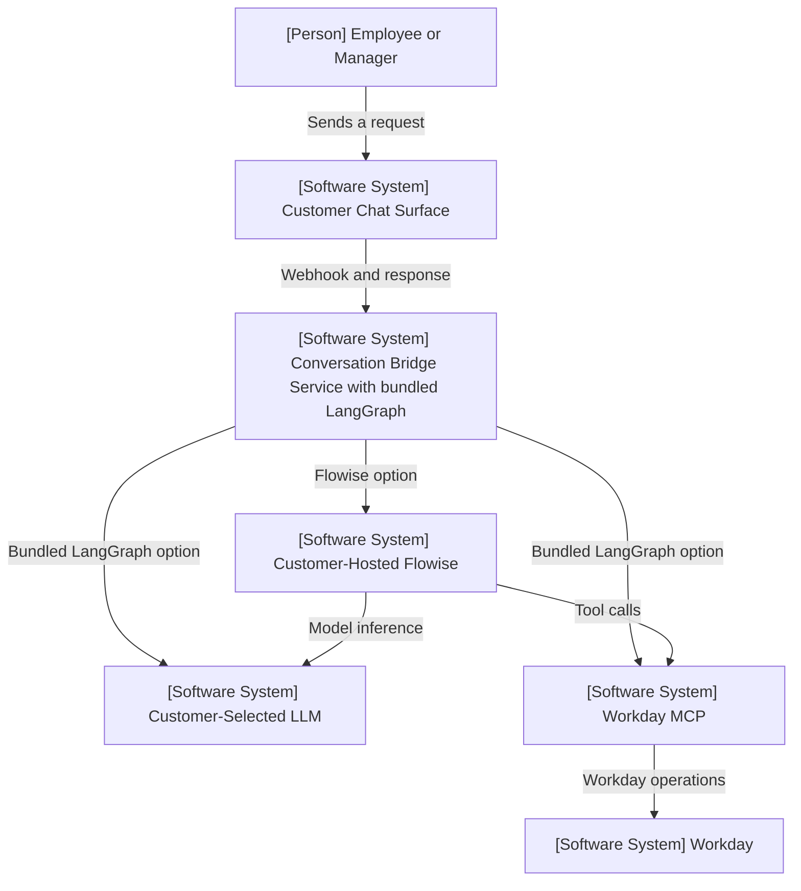
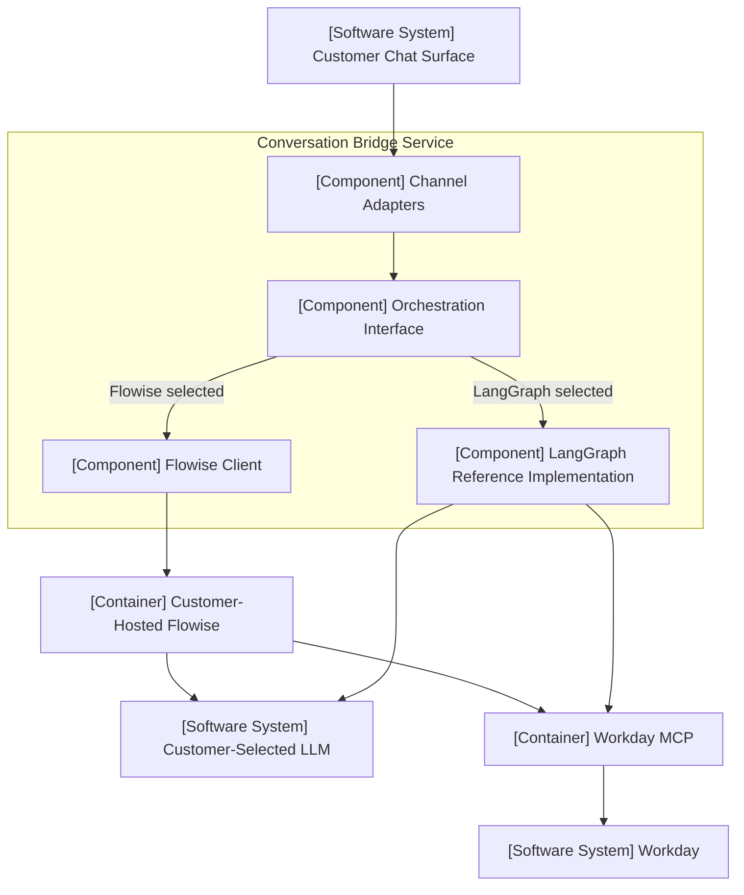

# Proposal v2: Add LangGraph as a Swappable Orchestrator


| Field    | Value                                                                           |
| -------- | ------------------------------------------------------------------------------- |
| Status   | Proposed                                                                        |
| Audience | Architecture Review Panel                                                       |
| Date     | 2026-07-23                                                                      |
| Scope    | Add LangGraph alongside Flowise and introduce a portable orchestration boundary |


## 1. Executive Summary

The AI Conversation Bridge currently calls Flowise directly from a single deployed service. As the future of Flowise is uncertain, this proposal evolves that deployment into a more modular **Conversation Bridge Service** and adds **LangGraph as a second supported orchestrator**, while retaining customer-hosted Flowise as a valid option.

Inside the service, Channel Adapters call a small **Orchestration Interface**. The Flowise implementation calls the customer's external Flowise runtime; the LangGraph reference implementation runs inside the same service. The chat platforms, LLMs, Workday MCP integration, and overall purpose of the bridge remain unchanged.

This proposal puts a spotlight on:

1. LangGraph as an alternative to Flowise.
2. The Orchestration Interface as the stable internal boundary.
3. Modularizing the Conversation Bridge Service around Channel Adapters and the Orchestration Interface.


## 2. Scope and Non-Goals


### In scope

- Add a LangGraph orchestration path.
- Retain the existing Flowise path.
- Introduce an Orchestration Interface above both runtimes.
- Bundle the LangGraph reference implementation with the Conversation Bridge Service.
- Keep the Flowise runtime external and customer-managed.
- Allow the selected orchestrator to be changed through configuration.
- Preserve the existing chat-platform, LLM, and Workday MCP relationships.


### Out of scope

- Replacing or deprecating Flowise.
- Automatically converting Flowise flows into LangGraph graphs.
- Detailed deployment, security, identity, state-store, or operational design.
- Changes to chat-platform behavior, Workday MCP, or downstream Workday services.
- Additional orchestrator implementations or A2A remote-agent integration.
- Production implementation.


## 3. Current and Proposed Architecture


### Current

The Conversation Bridge Service is directly aware of the Flowise prediction API. It constructs a Flowise-specific request, forwards the platform session ID, and parses the Flowise response. Channel handling and orchestration client logic are mixed in one service.

### Proposed

Channel-specific code is organized as Channel Adapters, which call the Orchestration Interface rather than a runtime-specific client.

Configuration selects one of two implementations:

- **Flowise:** a thin client calls the customer's external Flowise prediction API.
- **LangGraph:** the bundled reference graph executes inside the Conversation Bridge Service.

This is an additive change. Existing Flowise deployments do not need to migrate.

## 4. C4 Architecture Views


### C4 Level 1: System Context




Only one orchestration path is selected for a deployment. Flowise remains external; LangGraph runs inside the Conversation Bridge Service.

### C4 Level 2: Container View with Internal Modules




The Conversation Bridge Service is the single architecture boundary. Channel Adapters, the Orchestration Interface, the Flowise client, and the LangGraph reference implementation are modules inside it. A customer-hosted Flowise runtime is required only when Flowise is selected.

## 5. Before-and-After Comparison


| Dimension                   | Current architecture                         | Proposed architecture                              |
| --------------------------- | -------------------------------------------- | -------------------------------------------------- |
| Supported orchestrator      | Flowise                                      | Flowise or LangGraph                               |
| Deployed bridge component   | Conversation Bridge Service, Flowise-coupled | Conversation Bridge Service, modular               |
| Internal structure          | Routes and mixed orchestration clients       | Channel Adapters and Orchestration Interface       |
| Channel dependency          | Flowise API shape                            | Neutral Orchestration Interface                    |
| Runtime selection           | Hard-coded orchestrator branch               | Configuration through the orchestration factory    |
| Flowise support             | Primary path                                 | Retained as a supported path                       |
| Flowise runtime code        | External                                     | External; client and flow template only            |
| LangGraph support           | Not supported in this repository             | Bundled reference implementation                   |
| LLM integration             | Owned by Flowise                             | Owned by the selected orchestrator                 |
| MCP integration             | Owned by Flowise                             | Owned by the selected orchestrator                 |
| Agent definition            | Flowise flow                                 | Flowise flow or LangGraph graph                    |
| Core architecture boundary  | Conversation Bridge Service                  | Conversation Bridge Service                        |
| Adding another orchestrator | Modify route or client logic                 | Add another Orchestration Interface implementation |


## 6. Orchestration Interface

The Orchestration Interface is an internal code contract, not another deployed service. It preserves the narrow message and session boundary already used by Channel Adapters. At minimum, every orchestrator accepts:

- A user message.
- A conversation or session identifier.
- Optional request metadata when needed.

Every orchestrator returns:

- A final response in a common format.
- A normalized error when the runtime cannot complete the request.

Streaming may be defined as an optional capability, but it is not required for initial compatibility. Runtime-specific details remain inside each implementation:


| Concern               | Flowise implementation           | LangGraph implementation               |
| --------------------- | -------------------------------- | -------------------------------------- |
| Repository code       | Flowise client and flow template | Reference graph and execution code     |
| Execution location    | External customer-hosted Flowise | Inside the Conversation Bridge Service |
| Invocation            | Flowise prediction API           | In-process LangGraph graph invocation  |
| Session mapping       | Flowise `sessionId`              | LangGraph thread or state identifier   |
| Response parsing      | Flowise response fields          | LangGraph final graph state            |
| Runtime configuration | Flowise flow                     | LangGraph graph definition             |
| Model and tools       | Configured in Flowise            | Configured in the LangGraph runtime    |


Portability in this proposal means **caller portability**: Channel Adapters do not change when the orchestrator changes. It does not mean that Flowise flow definitions and LangGraph graph definitions are interchangeable.

## 7. LangGraph Alternative

The repository will provide a LangGraph reference implementation that functionally mirrors the sample Flowise flow. LangGraph takes responsibility for the same orchestration concerns:

- Invoking the selected LLM.
- Discovering and calling MCP tools.
- Maintaining conversation state.
- Executing the model-and-tool loop.
- Returning the final response through the Orchestration Interface.

Equivalent behavior means the same general prompt intent, MCP tools, session continuity, and response contract; it does not mean identical LLM output. LangGraph provides a code-first option for customers or teams that prefer explicit graph logic, source control, and Python-based extension. Flowise continues to provide a visual, low-code option that customers can self-host.

Neither option is positioned as universally better:

- Choose **Flowise** when visual authoring and rapid configuration are the priority.
- Choose **LangGraph** when code-level control and customization are the priority.


## 8. Proposed Repository Structure

```text
bridge-service/
├── app/
│   ├── api/
│   │   └── routes.py
│   ├── channels/
│   │   ├── lineworks.py
│   │   └── dingtalk.py
│   ├── orchestration/
│   │   ├── interface.py
│   │   ├── factory.py
│   │   ├── flowise.py
│   │   └── langgraph/
│   │       ├── graph.py
│   │       └── runtime.py
│   ├── config.py
│   └── response_validator.py
├── tests/
│   ├── channels/
│   ├── orchestration/
│   └── contract/
├── Dockerfile
└── main.py
```

The existing `flowise/` template directory remains separate. `mcp-demo-server/` remains sample demo tooling outside the bridge architecture. The current `chat-connector/` directory is renamed to `bridge-service/` and reorganized around Channel Adapters and the Orchestration Interface.

## 9. Business Value and Tradeoffs


### Business value

- Preserves customer choice between visual and code-first orchestration.
- Maintains support for customer-owned chat surfaces, models, and infrastructure.
- Gives customers a LangGraph path without forcing existing Flowise users to migrate.
- Reduces the cost of adding future orchestrators because Channel Adapters depend on one stable interface.
- Keeps Workday MCP available through either orchestration choice.


### Tradeoffs

- The project must maintain two implementations and their compatibility tests.
- Equivalent flows may behave differently across runtimes.
- Agent definitions remain runtime-specific.
- Bundling LangGraph increases the Conversation Bridge Service image size and couples channel and orchestration releases.

These tradeoffs are limited and explicit. The internal boundary allows later extraction if independent scaling, ownership, or additional callers justify it.

## 10. Future Expansion

The Orchestration Interface allows additional runtimes such as n8n or Dify to be added as new implementations. A future Workday-hosted runtime could fit the same pattern if it exposes a compatible top-level invocation API. Externally hosted runtimes would remain outside the Conversation Bridge Service and be reached through a thin client, similar to Flowise.

The bundled LangGraph implementation or another capable orchestrator could also delegate work to remote agents through A2A. A **Remote Agent Proxy** would present Workday, partner, or customer agents as subagents while translating local orchestration state into A2A tasks and responses.

These are extension points, not requirements for the current LangGraph proposal. MCP remains the reference mechanism for calling specific Workday tools; A2A would support higher-level task delegation to another agent.

## 11. Focused FAQ


### Is Flowise being replaced?

No. Flowise remains a supported, customer-hosted orchestration option. LangGraph is added as an alternative.

### Why add LangGraph?

LangGraph provides a code-first option with explicit graph logic and Python extensibility. It complements Flowise's visual authoring model.

### Why introduce an abstraction instead of calling LangGraph directly?

Direct integration would repeat the current Flowise coupling. The abstraction lets Channel Adapters remain unchanged when the selected runtime changes.

### Does this eliminate all orchestrator lock-in?

No. Flow definitions, graph definitions, memory behavior, and runtime configuration remain orchestrator-specific. The proposal isolates that coupling from chat platforms and Channel Adapters.

### Can a Flowise flow be automatically moved to LangGraph?

No automatic conversion is proposed. Equivalent behavior must be implemented and tested separately in each runtime.

### What code does this repository provide?

For Flowise, the repository provides a client and importable flow template; the Flowise runtime remains external. For LangGraph, the repository provides the reference graph and its execution code.

### What behavior must both implementations provide?

Both accept the same message and conversation context, preserve session continuity, and return the same normalized response and error shapes.

### Does this change the LLM or Workday MCP architecture?

No. The selected orchestrator continues to own its LLM and MCP integration.

### Which orchestrator becomes the default?

This proposal does not require changing the default. Each deployment selects Flowise or LangGraph through configuration.

### Can another orchestrator be added later?

Yes. A future runtime can be added by implementing the same interface without changing Channel Adapters.

### Why not deploy orchestration separately?

There is currently one caller, so a separate service would add deployment overhead and a network hop without a demonstrated need. The modular boundary allows extraction later if multiple callers or independent scaling require it.

## 12. Recommendation

Approve LangGraph as a second supported orchestration option, adopt the Orchestration Interface as the stable internal boundary, and modularize the Conversation Bridge Service around Channel Adapters.

The follow-up implementation should:

1. Formalize the existing message, session, response, and error contract.
2. Reorganize the Conversation Bridge Service directory around Channel Adapters and orchestration code.
3. Keep the current Flowise client as one Orchestration Interface implementation.
4. Add the bundled LangGraph reference implementation with equivalent sample-flow behavior.
5. Select the implementation through configuration.
6. Add shared contract tests that both implementations must pass.

This approach expands customer choice while preserving Flowise and minimizing changes to the rest of the architecture.