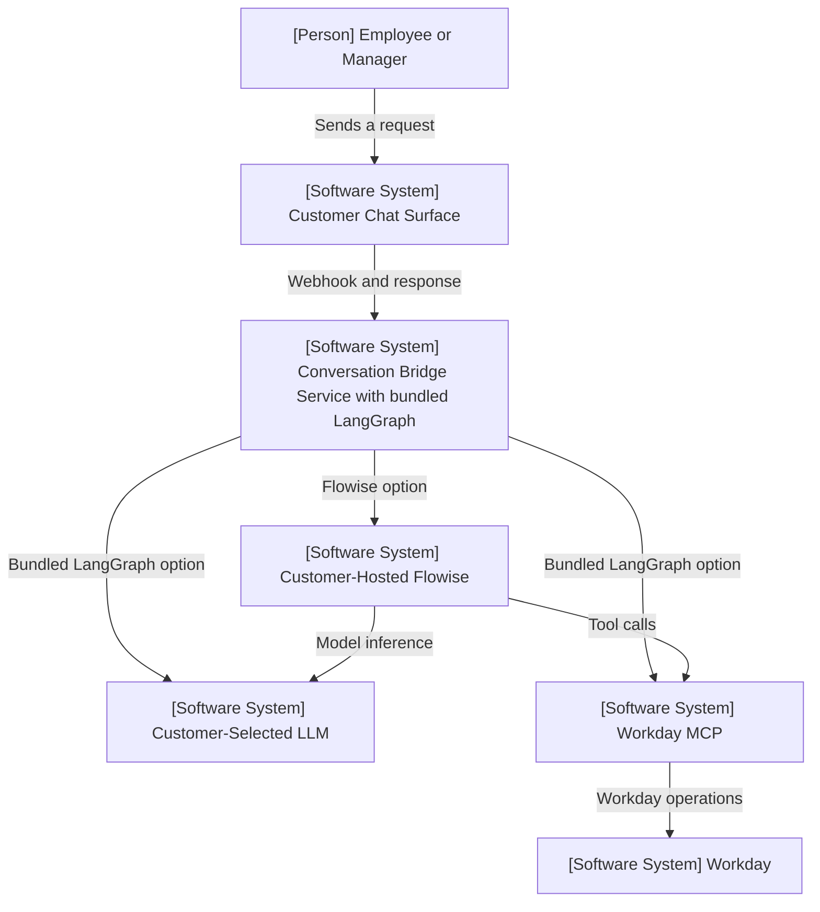
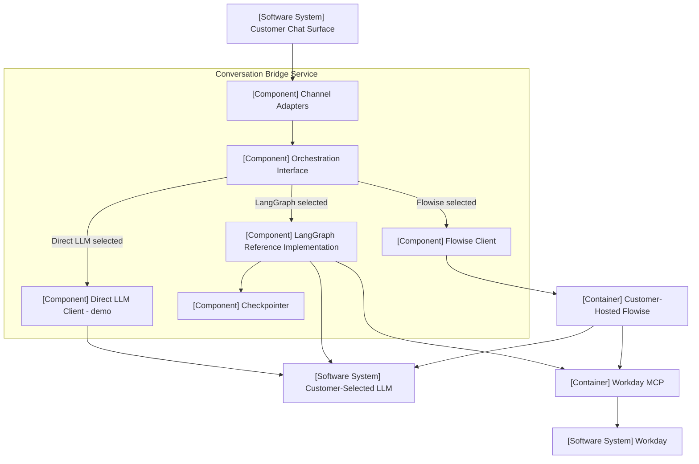

# Proposal v2.1: Add LangGraph as a Swappable Orchestrator

| Field      | Value                                                                           |
| ---------- | ------------------------------------------------------------------------------- |
| Status     | Proposed                                                                        |
| Audience   | Architecture Review Panel                                                       |
| Date       | 2026-08-07                                                                      |
| Supersedes | v2 (2026-07-23)                                                                 |
| Scope      | Add LangGraph alongside Flowise and introduce a portable orchestration boundary |

### Changes in v2.1

- Corrected the description of the current architecture: the repository already ships **three** AI providers behind a config switch and an implicit shared method signature. This proposal *formalizes* an existing boundary rather than introducing a new one.
- Repositioned OpenRouter as a `direct_llm` orchestrator and separated orchestrator selection from model-provider selection.
- Added §6.2 result and error contract, §6.3 conversation state, §6.4 configuration and secret custody, §6.5 execution model.
- Anchored the equivalence definition (§7.4) to the actual sample flow rather than to general intent.
- Replaced the repository structure in §8 and documented the rename blast radius.
- Added §10 risks and mitigations.
- Moved contract tests from a headline recommendation to future work.

## 1. Executive Summary

The AI Conversation Bridge calls its AI backend from a single deployed service. As the future of Flowise is uncertain, this proposal evolves that deployment into a more modular **Conversation Bridge Service** and adds **LangGraph as a supported orchestrator**, while retaining customer-hosted Flowise as a valid option.

The service already selects between providers through configuration, and its two provider clients already share an identical method signature. That implicit boundary is not expressed as a contract, is not consistently implemented, and cannot express failure. This proposal makes it explicit as an **Orchestration Interface**, then adds LangGraph as a third implementation behind it.

Inside the service, Channel Adapters call the Orchestration Interface. The Flowise implementation calls the customer's external Flowise runtime; the LangGraph reference implementation runs inside the same service. The chat platforms, LLMs, Workday MCP integration, and overall purpose of the bridge remain unchanged.

This proposal puts a spotlight on:

1. LangGraph as an alternative to Flowise.
2. The Orchestration Interface as the stable internal boundary.
3. Modularizing the Conversation Bridge Service around Channel Adapters and the Orchestration Interface.
4. The three consequences of running an orchestrator in-process: conversation state, secret custody, and the execution model.

## 2. Scope and Non-Goals

### In scope

- Add a LangGraph orchestration path.
- Retain the existing Flowise path.
- Formalize the Orchestration Interface above all implementations, including a typed result and error contract.
- Bundle the LangGraph reference implementation with the Conversation Bridge Service.
- Keep the Flowise runtime external and customer-managed.
- Reposition the existing OpenRouter client as a `direct_llm` implementation and separate orchestrator selection from model-provider selection.
- Select the orchestrator through configuration.
- Define a conversation-state seam and a reference-grade default backend.
- Document the configuration, secret-custody, and concurrency consequences of in-process orchestration.
- Preserve the existing chat-platform, LLM, and Workday MCP relationships.

### Out of scope

- Replacing or deprecating Flowise.
- Automatically converting Flowise flows into LangGraph graphs.
- A production-grade state backend, cross-thread long-term memory, or identity design.
- Detailed deployment, security, or operational hardening.
- Contract and regression tests. The repository has no test suite today; the interface is the natural seam for adding one later, and this proposal deliberately does not gate on it.
- Changes to chat-platform behavior, Workday MCP, or downstream Workday services.
- Additional orchestrator implementations or A2A remote-agent integration.
- Production implementation.

## 3. Current and Proposed Architecture

### Current

The service supports two AI providers, selected at import time by the `AI_PROVIDER` environment variable (`chat-connector/app/config.py`, `chat-connector/app/routes.py`):

- **Flowise** — a client that posts to the customer's external prediction API.
- **OpenRouter** — a direct chat-completions client with a process-local message history, documented as demo and experimental.

Both expose `get_completion(user_message, user_id)`. So a provider boundary and a configuration switch already exist. Four things are missing:

1. The signature is a convention, not a declared contract, and nothing enforces it.
2. Neither implementation can express failure. Both catch every exception and return a user-facing English sentence in place of the model's answer, so callers, logs, and health checks cannot distinguish an answer from an outage.
3. Provider clients are constructed at module import, which couples the HTTP layer to provider configuration.
4. Channel handling, platform API clients, and provider clients are mixed under one `services/` directory.

The Flowise path additionally hard-codes Flowise request and response shapes into the client, and the channel routes construct the platform-scoped session ID that Flowise uses for conversation memory.

### Proposed

Channel-specific code is organized as Channel Adapters, which call the Orchestration Interface rather than a runtime-specific client. Configuration selects one implementation:

- **Flowise** — a thin client calls the customer's external Flowise prediction API. Unchanged in behavior.
- **LangGraph** — the bundled reference graph executes inside the Conversation Bridge Service.
- **Direct LLM** — the existing OpenRouter client, re-homed behind the interface. No tools, no MCP, no graph. Demo and smoke-test use only.

This is an additive change. Existing Flowise deployments do not need to migrate, and existing OpenRouter deployments keep working through a deprecated alias.

## 4. C4 Architecture Views

### C4 Level 1: System Context



Only one orchestration path is selected for a deployment. Flowise remains external; LangGraph runs inside the Conversation Bridge Service.

### C4 Level 2 / 3: Container View with Internal Components

This view mixes levels deliberately: the Conversation Bridge Service is the only container in the bridge boundary, so its internal components are shown inline rather than in a separate Level 3 diagram.



The Conversation Bridge Service is the single architecture boundary. A customer-hosted Flowise runtime is required only when Flowise is selected. The checkpointer is reached only by the LangGraph implementation; when Flowise is selected, conversation state stays in the customer's Flowise runtime and the bridge remains stateless.

## 5. Before-and-After Comparison

| Dimension                   | Current architecture                                | Proposed architecture                                        |
| --------------------------- | --------------------------------------------------- | ------------------------------------------------------------ |
| Supported providers         | Flowise, OpenRouter (demo)                          | Flowise, LangGraph, Direct LLM (demo)                        |
| Orchestration boundary      | Implicit shared method signature                    | Declared Orchestration Interface                             |
| Runtime selection           | `AI_PROVIDER`, branched at module import            | `ORCHESTRATOR`, resolved by a factory in the app factory     |
| Model-provider selection    | Fused with provider selection                       | Separate `LLM_*` configuration, shared by LangGraph and Direct LLM |
| Failure signalling          | User-facing English string returned as the answer   | Typed failure code; channel adapter owns presentation        |
| Internal structure          | Routes plus a mixed `services/` directory           | Channel Adapters, platform clients, orchestration, core      |
| Channel dependency          | Flowise API shape                                   | Neutral Orchestration Interface                              |
| Conversation state          | External to the bridge (Flowise) or process-local dict (OpenRouter) | Declared checkpointer seam with a selectable backend |
| Bridge statefulness         | Stateless in the Flowise path                       | Stateless for Flowise; stateful for LangGraph                |
| LLM and MCP credentials     | Held by the customer's Flowise                      | Held by the bridge when LangGraph is selected                |
| Work per request            | One outbound HTTP call                              | A model-and-tool loop when LangGraph is selected             |
| Agent definition            | Flowise flow                                        | Flowise flow or LangGraph graph                              |
| Core architecture boundary  | Conversation Bridge Service                         | Conversation Bridge Service                                  |
| Adding another orchestrator | Add a branch and a client                           | Add another Orchestration Interface implementation           |

## 6. Orchestration Interface

The Orchestration Interface is an internal code contract, not another deployed service. It preserves the narrow message and session boundary already used by the channel routes.

### 6.1 Request and result

Every orchestrator accepts:

- A user message.
- A conversation or session identifier, used as the orchestrator's thread key.
- Optional request metadata.

Every orchestrator returns either a successful result carrying the final response text, or a typed failure (§6.2).

The interface is declared **async-capable** from the outset. The service runs synchronously today (§6.5), but LangGraph and the MCP client libraries are async-native, and declaring the interface async now means a later move to an ASGI server or to deferred replies does not require changing the contract or the callers.

Streaming is defined as an optional capability and is not required for initial compatibility. Neither supported channel streams: LINE WORKS and DingTalk both receive the reply through a separate outbound API call, not through the webhook response body.

### 6.2 Result and error contract

Today each provider client decides the user-facing text for every failure, in English, and returns it as though it were the model's answer. The strings are duplicated across the two clients and have already drifted — the Flowise client says "The AI service is temporarily rate-limited" where the OpenRouter client says "The AI model is temporarily rate-limited," and their configuration-error strings differ as well. A third implementation would make three copies.

The interface separates three concerns that are currently fused:

| Layer            | Owns                                                                                              |
| ---------------- | ------------------------------------------------------------------------------------------------- |
| Orchestrator     | A typed result: response text, or a failure code plus internal detail that is never shown to users |
| Channel adapter  | Presentation and localization of that failure                                                     |
| Operations       | Counting and alerting on failure codes, now that they are distinguishable from successful replies |

Failure codes:

| Code             | Raised when                                                | Default English message (unchanged from today)                                                |
| ---------------- | ---------------------------------------------------------- | --------------------------------------------------------------------------------------------- |
| `configuration`  | Required configuration is missing or invalid               | "I am currently unable to think (Configuration Error)."                                        |
| `timeout`        | The runtime did not respond within the configured budget   | "Sorry, the AI service is taking longer than expected. Please try again in a moment."           |
| `rate_limited`   | The runtime or model returned HTTP 429                     | "The AI service is temporarily rate-limited. Please wait a moment and try again."               |
| `upstream_error` | The runtime returned an error response                     | "Sorry, the AI service returned an error. Please try again later."                              |
| `unavailable`    | Any other unexpected failure                               | "Sorry, I encountered an error while processing your request."                                  |

Three properties make this change low-risk and worth doing now:

- **Behavior-preserving by default.** Each code maps to the string already in use, so existing deployments see identical output. The change is invisible to users.
- **It unlocks localization.** The repository ships documentation in four locales, but a Japanese-language deployment currently answers timeouts in English from a literal buried in a provider client. Once failures are codes, the channel adapter can localize them.
- **It stops the duplication.** Adding an orchestrator no longer means copying five apology strings.

`configuration` is a special case. Missing configuration is a deployment defect, not a runtime condition, and should be caught at startup rather than answered politely to every user (§6.4).

### 6.3 Conversation state

Conversation state is where bundling an orchestrator changes the service most, so the seam is specified here even though a production-grade backend is out of scope.

**How state works today.** In the Flowise path the bridge is stateless: it forwards a platform-scoped session ID (`lineworks:<userId>`, `dingtalk:<conversationId>:<senderStaffId>`) as `overrideConfig.sessionId`, and the customer's Flowise runtime holds the history — the sample flow uses `agentMemoryType: windowSize`. In the OpenRouter path the client keeps a process-local dictionary of per-user history trimmed to ten messages, which survives only because the service runs a single worker in a single instance.

**How LangGraph works.** LangGraph persists state through a **checkpointer**: an implementation of `BaseCheckpointSaver` that snapshots graph state after each superstep, keyed by a `thread_id` supplied at invocation. On the next message with the same `thread_id` the graph rehydrates from the last checkpoint. The existing platform-scoped session IDs map onto `thread_id` directly, so session continuity carries over without changing the channel layer.

**Reference default and its limit.** The reference implementation uses the in-memory checkpointer (`InMemorySaver`): no setup, no external dependency, correct for a reference architecture. Its limitation must be stated plainly rather than discovered:

> Cloud Run session affinity is cookie-based. LINE WORKS and DingTalk are server-to-server webhook callers and send no cookies, so conversations **cannot** be pinned to an instance. With more than one instance, a user's messages land on arbitrary instances and their context appears to reset at random. Scale-to-zero discards state entirely on cold start.

The in-memory backend is therefore documented as single-instance only, and the reference deployment pins `--min-instances=1 --max-instances=1`.

**The abstraction.** `BaseCheckpointSaver` is already the platform-agnostic seam; the bridge does not define a second storage abstraction over it. What the bridge adds is a factory:

```
STATE_BACKEND=memory | firestore | postgres   →   make_checkpointer(config) -> BaseCheckpointSaver
```

Notes for whoever implements a persistent backend:

- Prefer an existing community or first-party saver (Postgres, Redis, SQLite, MongoDB) over writing one. Verify current availability before committing to a package.
- Firestore has no first-party saver and would require a custom `BaseCheckpointSaver`. This is more than a key-value put: checkpoint tuples, channel values, pending writes, version bookkeeping, and `list()` for history all have to be correct.
- Two rapid messages on one thread produce concurrent checkpoint writes. Choose optimistic concurrency or a per-thread lock; this is a known bug class in chat agents.

**Enterprise considerations, recorded here and deferred.** A persistent conversation store holding HR data is where an enterprise security review will concentrate. Deferring the design is reasonable; leaving it unnamed is not.

- **Namespace by tenant, not only by user** — `(tenant, channel, user_id)`. The existing channel-scoped session IDs are the right precedent to extend.
- **Chat identity is not Workday identity.** The thread key is a chat-platform identity. Persisted state must never become a path by which one person's Workday data surfaces in another's session — particularly in DingTalk group chats, which is why `DINGTALK_GROUP_SESSIONS_PER_USER` already exists.
- **Retention, TTL, and erasure.** Checkpoints will contain HR and personal data. A TTL and a delete-by-subject path are required. The project ships documentation in four locales and is therefore deployed into GDPR, PIPL, and APPI jurisdictions.
- **Residency and encryption.** Region-pinned storage per tenant; customer-managed keys where required.
- **Minimize what is persisted.** Redact, or store references instead of raw tool payloads. Checkpoint history is replayable, which is a debugging feature and a liability at once.

**Beyond thread state.** Production agent memory usually separates two tiers: thread-scoped state (above), and cross-thread long-term memory held in a store namespaced by user — semantic facts, episodic summaries, procedural instructions — written either on the hot path or in the background after the reply. This proposal implements only the first tier and names the second as the seam for later work. On Cloud Run, note that background writes after the response require always-allocated CPU.

### 6.4 Configuration and secret custody

The mechanism for supplying secrets does not change: environment variables set in the Cloud Run console or a local `.env`. What changes is **who holds what**, and therefore what a single process compromise exposes.

| Secret or setting                       | Flowise selected      | LangGraph selected          |
| --------------------------------------- | --------------------- | --------------------------- |
| Chat platform credentials               | Bridge                | Bridge                      |
| Flowise API key                         | Bridge                | —                           |
| LLM API key and base URL                | Customer's Flowise    | **Bridge**                  |
| MCP server URL and authorization header | Customer's Flowise    | **Bridge**                  |
| System prompt and tool allowlist        | Customer's Flowise flow | **Bridge (code and config)** |

Today this is two trust domains: the bridge can reach Flowise but holds nothing that talks to a model or to Workday tools. Selecting LangGraph collapses that into one process holding all of it. This is not a defect — it is the direct consequence of removing a hop — but it is a materially different threat model, and existing documentation is written around Flowise owning the MCP relationship. `docs/architecture.md` and `docs/enterprise-guide.md` need conditional wording, in all locales.

Three requirements follow:

1. **Fail fast on configuration.** Required settings differ per orchestrator. Validate them at startup so a misconfigured deployment fails to boot, rather than answering every user with an apology at request time — which is what happens today.
2. **Prefer secret references.** On Cloud Run, mount the LLM key and MCP authorization header from Secret Manager rather than as plain environment variables. Never place the MCP credential in a URL, and keep it out of logs.
3. **The customization story changes.** With Flowise a customer edits a prompt in a UI. With LangGraph the prompt and tool allowlist are repository artifacts, so customizing means forking code or exposing them as configuration. This is arguably the most decision-relevant difference for a non-engineering buyer and belongs in the choice guidance (§7.5).

### 6.5 Execution model and concurrency

The container runs `gunicorn -b 0.0.0.0:8080 --timeout 180 main:app` with no `--workers` or `--threads`. Gunicorn's defaults are one synchronous worker with one thread, so the service handles **one request at a time**, while Cloud Run's default per-instance concurrency is 80. Today that is tolerable because the work is a single outbound HTTP POST — though it does mean one in-flight call, up to `FLOWISE_TIMEOUT=120`, already blocks every other user on the instance.

Bundling LangGraph changes the shape of that work:

| Aspect                       | Flowise selected                            | LangGraph bundled                                          |
| ---------------------------- | ------------------------------------------- | ---------------------------------------------------------- |
| Work in the request thread   | One blocking HTTP call                      | N model calls plus M tool calls, serially                   |
| Wall-clock per message       | One round trip                              | Multiplied by loop iterations                               |
| CPU in the bridge            | Negligible                                  | Token handling, parsing, tool marshalling                   |
| Where the loop runs          | Customer's Flowise, with its own concurrency | The bridge's single worker                                  |
| Failure mode on overrun      | 120s timeout, then a `timeout` result       | Exceeds gunicorn's 180s: **worker killed, no reply at all** |

Three options, with tradeoffs:

**A. Stay synchronous and tune it.** Set `--workers` and `--threads` deliberately, align Cloud Run `--concurrency` with real parallelism, and raise the gunicorn timeout above the worst-case loop. Threads rather than processes are the efficient lever, since the work is I/O-bound — but note the interaction with §6.3: threads share process memory and workers do not, so `--workers 4` would fragment in-memory conversation state across workers while `--threads 4` would not. Cheapest option, and honest for a reference architecture.

**B. Acknowledge immediately, reply out of band.** Return 200 as soon as the webhook is validated, then process and reply through the platform's outbound API. This fits the existing architecture unusually well: **both channels already reply out of band**, through the LINE WORKS message API and DingTalk's session webhook respectively, so the HTTP response body is already only an acknowledgement. Costs: reliability requires always-allocated CPU or a real queue, and delivery becomes at-least-once, which requires idempotency on inbound message IDs — absent today, meaning platform retries during a long loop can already produce duplicate replies.

**C. Move to ASGI.** LangGraph and the MCP adapters are async-native. Under synchronous Flask each invocation would be wrapped in `asyncio.run()`, creating and tearing down an event loop per request and preventing reuse of MCP sessions — a fresh `initialize` and `tools/list` handshake on every user message, which is pure added latency per turn. FastAPI or Quart fixes this properly; `httpx` is already async-capable, so the channel clients port cleanly. Largest change, best end state.

**Recommendation:** adopt **A** with explicitly documented worker, concurrency, and timeout settings, and cache MCP tool schemas at startup rather than rediscovering them per request. Keep the interface async-capable (§6.1) so that **B** or **C** later requires no contract change. **B** is the designated evolution path, and the channels are already shaped for it.

### 6.6 Runtime-specific details

Everything below the interface stays inside each implementation:

| Concern               | Flowise implementation           | LangGraph implementation               | Direct LLM implementation      |
| --------------------- | -------------------------------- | -------------------------------------- | ------------------------------ |
| Repository code       | Client only; flow template at repo root | Reference graph and execution code | Chat-completions client        |
| Execution location    | External customer-hosted Flowise | Inside the Conversation Bridge Service | Inside the service             |
| Invocation            | Flowise prediction API           | In-process graph invocation            | Direct chat-completions call   |
| Session mapping       | Flowise `sessionId`              | LangGraph `thread_id`                  | Process-local history key      |
| Response parsing      | Flowise response fields          | Final graph state                      | `choices[0].message.content`   |
| Conversation state    | External to the bridge           | Checkpointer (§6.3)                    | Process-local, demo-grade      |
| Model and tools       | Configured in Flowise            | Configured in the bridge               | Model only; no tools           |

Portability in this proposal means **caller portability**: Channel Adapters do not change when the orchestrator changes. It does not mean that Flowise flow definitions and LangGraph graph definitions are interchangeable.

## 7. Orchestrator Implementations

### 7.1 Flowise

Unchanged in behavior. A thin client posts to the customer's external prediction API and forwards the platform-scoped session ID. The runtime, the flow, the model credentials, and the MCP relationship all remain customer-managed. The importable flow template stays at the repository root (§8).

### 7.2 LangGraph

A bundled reference graph that runs in-process and takes responsibility for the concerns Flowise currently owns: invoking the LLM, discovering and calling MCP tools, maintaining conversation state, executing the model-and-tool loop, and returning the final response through the interface.

### 7.3 Direct LLM

The existing OpenRouter client, re-homed behind the interface as `direct_llm`. This resolves a naming problem the current design would otherwise inherit: OpenRouter presently occupies **two different roles** — an orchestrator-level choice (`AI_PROVIDER=openrouter`) and the model provider behind both other orchestrators (the sample flow uses `chatOpenRouter` with `z-ai/glm-4.5-air:free`). Under three orchestrators that becomes actively confusing.

The proposal therefore separates the two axes:

- `ORCHESTRATOR=flowise | langgraph | direct_llm`
- `LLM_*` settings (base URL, model, key), shared by `langgraph` and `direct_llm`, defaulting to OpenRouter

`AI_PROVIDER=openrouter` continues to resolve to `direct_llm` with a deprecation log, following the existing `CHAT_PROVIDER` fallback pattern.

Retaining it is worthwhile despite LangGraph-with-no-tools being functionally similar: it is the only path requiring no external dependency beyond one API key — no Flowise instance, no MCP server, no checkpointer — which makes it the smoke-test path for verifying that chat webhooks are wired correctly. It also demonstrates that the interface accommodates a trivial implementation. It remains labelled demo and experimental, and is not a supported production path.

### 7.4 What equivalence means

The LangGraph reference implementation mirrors `flowise/flows/workday-mcp-agent.json`. Concretely, it reproduces:

- **Prompt intent** — the same system-prompt role and directives as the flow's `agentMessages`.
- **Tools** — the same MCP server and the same explicit tool allowlist as the flow's `mcpActions`. The flow also carries an unrelated `requestsGet` RSS-news tool used for demonstration; the reference graph omits it.
- **Model settings** — the flow's OpenRouter base path, `z-ai/glm-4.5-air:free`, temperature 0.2, carried as `LLM_*` configuration rather than hard-coded.
- **Memory** — windowed message history, matching the flow's `windowSize` memory, persisted through the checkpointer.
- **Session continuity** — the same platform-scoped session identifiers.
- **Response and error contract** — §6.1 and §6.2.

One flow setting is deliberately **not** reproduced: the MCP node sets `approvalPolicy: "always"`, implying human approval before tool execution. Neither supported channel offers an approval surface, and a webhook reply cannot block on one. The reference graph therefore executes allowlisted tools without an approval step, and human-in-the-loop approval — which LangGraph supports through interrupts — is recorded as future work requiring channel-side interaction design.

Equivalence means matching intent, tools, session continuity, and contract. It does not mean identical LLM output.

### 7.5 Choosing between them

Neither option is positioned as universally better:

- Choose **Flowise** when visual authoring, rapid configuration, and prompt changes without a code deploy are the priority, and when keeping model and MCP credentials outside the bridge is preferred.
- Choose **LangGraph** when code-level control, source-controlled agent definitions, and Python extensibility are the priority, and when a single deployable is preferred over operating a second runtime.

## 8. Proposed Repository Structure

```text
ai-conversation-bridge/
├── bridge-service/       # the one deployable: channels plus orchestration
├── flowise/              # importable template for the external Flowise runtime
├── mcp-demo-server/      # demo tool provider
└── docs/
```

```text
bridge-service/
├── app/
│   ├── __init__.py                  # create_app(); builds adapters and orchestrator here,
│   │                                #   not at module import
│   ├── config.py                    # env to settings, per-orchestrator fail-fast validation
│   ├── api/
│   │   └── routes.py                # thin HTTP layer: route -> adapter -> orchestrator -> adapter
│   ├── channels/                    # inbound webhook handling and outbound replies
│   │   ├── base.py                  # ChannelAdapter protocol, InboundMessage
│   │   ├── lineworks/
│   │   │   ├── adapter.py           # signature verification, parsing, session-id derivation
│   │   │   └── client.py            # LINE WORKS API: JWT auth, send_message
│   │   └── dingtalk/
│   │       ├── adapter.py           # parse_message, should_process, session-id derivation
│   │       └── client.py            # session-webhook send
│   ├── orchestration/
│   │   ├── base.py                  # request/result types and Protocol, async-capable
│   │   ├── errors.py                # failure taxonomy and default message mapping
│   │   ├── factory.py               # ORCHESTRATOR -> implementation
│   │   ├── models.py                # shared LLM client configuration
│   │   ├── flowise/
│   │   │   └── client.py
│   │   ├── direct_llm/
│   │   │   └── client.py            # former openrouter.py; demo passthrough, no tools
│   │   └── langgraph/
│   │       ├── runtime.py           # implements the interface; owns invocation
│   │       ├── graph.py             # graph definition
│   │       ├── prompts.py           # system prompt, mirrors the sample flow
│   │       ├── tools/
│   │       │   └── mcp.py           # MCP client, tool allowlist, schema caching
│   │       └── state/
│   │           ├── factory.py       # make_checkpointer() -> BaseCheckpointSaver
│   │           └── firestore.py     # future backend
│   └── core/
│       ├── response_validator.py    # cross-cutting; neither channel- nor orchestrator-specific
│       ├── messages.py              # user-facing strings, localizable
│       └── logging.py
├── tests/                           # future
├── Dockerfile
├── requirements.txt
└── main.py
```

Rationale for the four changes from the current layout:

1. **`channels/<platform>/{adapter,client}.py`.** The existing `lineworks.py` and `dingtalk.py` are not only inbound adapters; they hold signature verification, JWT token acquisition, and outbound send. Separating inbound translation from the platform API client makes adapters testable without mocking HTTP, and it scales along the axis the project is actually growing — DingTalk was a recent contribution.
2. **`orchestration/models.py`.** One place turns `LLM_*` configuration into a model client, consumed by both `langgraph` and `direct_llm`. This is what makes orchestrator choice and model choice visibly independent (§7.3).
3. **`core/`.** `response_validator.py` is neither channel- nor orchestrator-specific, and `messages.py` gives the localizable failure strings a home once they leave the orchestrator clients (§6.2).
4. **Construction moves into `create_app()`.** Provider clients are currently instantiated at module import, so importing the routes module reads the environment and builds a provider. With a factory and three implementations, wiring in the app factory keeps the selection swappable and the HTTP layer independent of provider configuration.

### Why the Flowise template stays at the repository root

`flowise/` does not move into `bridge-service/`. The two agent definitions are asymmetric by nature, and that asymmetry is exactly the runtime boundary this proposal draws:

|                          | Flowise flow (`workday-mcp-agent.json`) | LangGraph graph (`graph.py`)   |
| ------------------------ | --------------------------------------- | ------------------------------ |
| What it is               | Config for a runtime the **customer** operates | Source compiled into **your** image |
| Consumed by              | A human, importing it into a Flowise UI | The Python process at startup  |
| Shipped in the container | No, and must not be                     | Yes                            |
| Lifecycle                | The customer's Flowise instance         | The bridge release             |

The Flowise **client** belongs in the service because it is the bridge's outbound code; the **template** does not, because it is configuration for an external system. Client inside, template outside, mirroring the runtime boundary. `flowise/` also carries its own README and screenshots and is translated across four locales, so moving or renaming it would add locale path breakage for no architectural gain.

### Rename blast radius

`chat-connector/` becomes `bridge-service/`. This is a breaking change, accepted deliberately, and needs to be spelled out in release notes. Affected:

- `docker-compose.yml`, `.env.example`, `chat-connector/.env.example`
- `scripts/setup.sh`, `scripts/deploy-cloud-run.sh` — including the **Cloud Run service name**, which changes the service URL and therefore requires re-pointing both chat platforms' callback URLs. This is the part that actually breaks existing deployments.
- `.github/dependabot.yml` — two entries (pip and docker)
- `README.md`, `CONTRIBUTING.md`, `docs/architecture.md`, `docs/setup-guide.md`
- The same documents under `i18n/ja/`, `i18n/ko/`, `i18n/zh-Hans/`, `i18n/zh-Hant/`

`mcp-demo-server/` is unaffected and remains sample demo tooling outside the bridge architecture.

## 9. Business Value and Tradeoffs

### Business value

- Preserves customer choice between visual and code-first orchestration.
- Maintains support for customer-owned chat surfaces, models, and infrastructure.
- Gives customers a LangGraph path without forcing existing Flowise users to migrate.
- Reduces the cost of adding future orchestrators, because Channel Adapters depend on one stable interface.
- Keeps Workday MCP available through either orchestration choice.
- Makes failures observable and localizable for the first time (§6.2).

### Tradeoffs

- The project must maintain three implementations.
- Equivalent definitions may behave differently across runtimes.
- Agent definitions remain runtime-specific.
- **The system prompt exists in two formats that cannot share a source.** In the flow it is HTML embedded in JSON (`agentMessages`); in LangGraph it is plain text in `prompts.py`. There is no practical single canonical copy, so equivalence is maintained by hand and will drift the first time someone edits one side. The same applies to the MCP tool allowlist, pinned in the flow's `mcpActions` and again in `tools/mcp.py`. Mitigation is a reciprocal note in `flowise/README.md` and `prompts.py` stating that the two must be updated together.
- **Dependency weight and licence review.** `requirements.txt` is six pinned packages today. Adding LangGraph, its checkpoint package, LangChain core, an MCP adapter, and a model SDK is a step change in image size, Dependabot surface, and transitive-licence review for a published repository. Licence review should happen before implementation, not after.
- Bundling LangGraph couples channel and orchestration releases.
- Selecting LangGraph makes the bridge stateful (§6.3), moves model and MCP credentials into it (§6.4), and changes its concurrency profile (§6.5).

These tradeoffs are limited and explicit. The internal boundary allows later extraction if independent scaling, ownership, or additional callers justify it.

## 10. Risks and Mitigations

| Risk                                                                                     | Likelihood | Impact | Mitigation                                                                                                    |
| ---------------------------------------------------------------------------------------- | ---------- | ------ | -------------------------------------------------------------------------------------------------------------- |
| Conversation context resets at random under multi-instance deployment with in-memory state | High if unpinned | High | Pin `--max-instances=1` for the reference deployment; document the constraint; provide the `STATE_BACKEND` seam |
| LangGraph loop exceeds the gunicorn timeout, killing the worker with no reply sent        | Medium     | High   | Raise the request timeout above worst-case loop; bound tool iterations; adopt §6.5 option A settings            |
| Long in-request processing triggers platform webhook retries and duplicate replies         | Medium     | Medium | Document the timeout budget; add inbound message-ID idempotency when adopting §6.5 option B                     |
| Wider secret custody in the bridge fails an enterprise security review                    | Medium     | High   | Document custody explicitly (§6.4); use Secret Manager references; keep the Flowise path available unchanged    |
| Prompt and tool allowlist drift between the flow and the graph                            | High       | Medium | Reciprocal update notes in both artifacts; treat as a single change unit in review                              |
| Transitive licence or supply-chain issue from the LangChain dependency tree               | Medium     | Medium | Licence review before implementation; keep Dependabot entries updated after the rename                          |
| Rename breaks existing deployments' callback URLs                                         | High       | Medium | Release-note the Cloud Run service-name change and the callback re-pointing steps                               |
| No test suite exists to catch regressions from the restructure                            | High       | Medium | Accepted for a reference architecture; the interface is the seam for adding tests later                         |

## 11. Future Expansion

The Orchestration Interface allows additional runtimes such as n8n or Dify to be added as new implementations. A future Workday-hosted runtime could fit the same pattern if it exposes a compatible top-level invocation API. Externally hosted runtimes would remain outside the Conversation Bridge Service and be reached through a thin client, similar to Flowise.

Within the LangGraph path, the named extension points are: a persistent checkpointer backend, cross-thread long-term memory, human-in-the-loop tool approval through graph interrupts (§7.4), deferred replies (§6.5 option B), and a move to ASGI (§6.5 option C).

The bundled LangGraph implementation or another capable orchestrator could also delegate work to remote agents through A2A. A **Remote Agent Proxy** would present Workday, partner, or customer agents as subagents while translating local orchestration state into A2A tasks and responses.

These are extension points, not requirements for the current proposal. MCP remains the reference mechanism for calling specific Workday tools; A2A would support higher-level task delegation to another agent.

## 12. Focused FAQ

### Is Flowise being replaced?

No. Flowise remains a supported, customer-hosted orchestration option. LangGraph is added as an alternative.

### Why add LangGraph?

LangGraph provides a code-first option with explicit graph logic and Python extensibility. It complements Flowise's visual authoring model.

### Does the repository not already switch providers by configuration?

Yes, and this proposal builds on that. `AI_PROVIDER` already selects between Flowise and OpenRouter, and both clients already share a method signature. What is missing is a declared contract, a way to express failure, and a structure that does not fuse channel handling with provider clients. This proposal formalizes an existing boundary rather than inventing one.

### What happens to the OpenRouter provider?

It becomes the `direct_llm` implementation: a demo passthrough with no tools, MCP, or graph. `AI_PROVIDER=openrouter` continues to work through a deprecation alias. Separately, OpenRouter remains available as the *model provider* behind LangGraph and Flowise — those are now distinct configuration axes.

### Does this eliminate all orchestrator lock-in?

No. Flow definitions, graph definitions, memory behavior, and runtime configuration remain orchestrator-specific. The proposal isolates that coupling from chat platforms and Channel Adapters.

### Can a Flowise flow be automatically moved to LangGraph?

No automatic conversion is proposed. Equivalent behavior is implemented separately in each runtime, per §7.4.

### Does this change the LLM or Workday MCP architecture?

The architecture of MCP itself does not change, but **custody does**. When LangGraph is selected, the bridge holds the LLM key and the MCP credential that previously lived in the customer's Flowise. See §6.4.

### Does the bridge become stateful?

Only when LangGraph is selected. The Flowise path stays stateless. See §6.3, including the single-instance constraint of the reference state backend.

### Which orchestrator becomes the default?

The default remains unchanged. Each deployment selects its orchestrator through configuration.

### Where do contract tests fit?

They are out of scope here. The repository has no test suite today, so adding one is separate work; the Orchestration Interface is the seam that makes it straightforward when it happens.

### Why not deploy orchestration separately?

There is currently one caller, so a separate service would add deployment overhead and a network hop without a demonstrated need. The modular boundary allows extraction later if multiple callers or independent scaling require it.

## 13. Recommendation

Approve LangGraph as a supported orchestration option, adopt the Orchestration Interface as the stable internal boundary, and modularize the Conversation Bridge Service around Channel Adapters.

The follow-up implementation should:

1. Declare the Orchestration Interface, including the typed result and failure contract, mapped to today's exact user-facing strings so behavior is preserved.
2. Reorganize `chat-connector/` into `bridge-service/` per §8, moving client construction into the application factory.
3. Keep the Flowise client as one implementation, unchanged in behavior.
4. Re-home the OpenRouter client as `direct_llm`, and split `ORCHESTRATOR` from `LLM_*` configuration with a deprecation alias for `AI_PROVIDER=openrouter`.
5. Add the bundled LangGraph reference implementation, matching the equivalence definition in §7.4.
6. Add the checkpointer factory with the in-memory default, and document the single-instance constraint.
7. Add per-orchestrator startup configuration validation.
8. Apply the §6.5 option A execution settings, and cache MCP tool schemas at startup.
9. Update documentation, `.env.example`, deployment scripts, and Dependabot for the rename, in all locales.

This approach expands customer choice while preserving Flowise and minimizing changes to the rest of the architecture.
