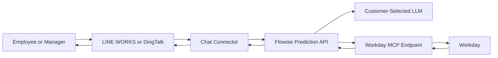
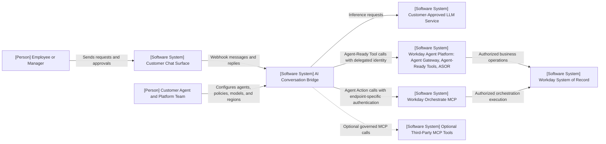
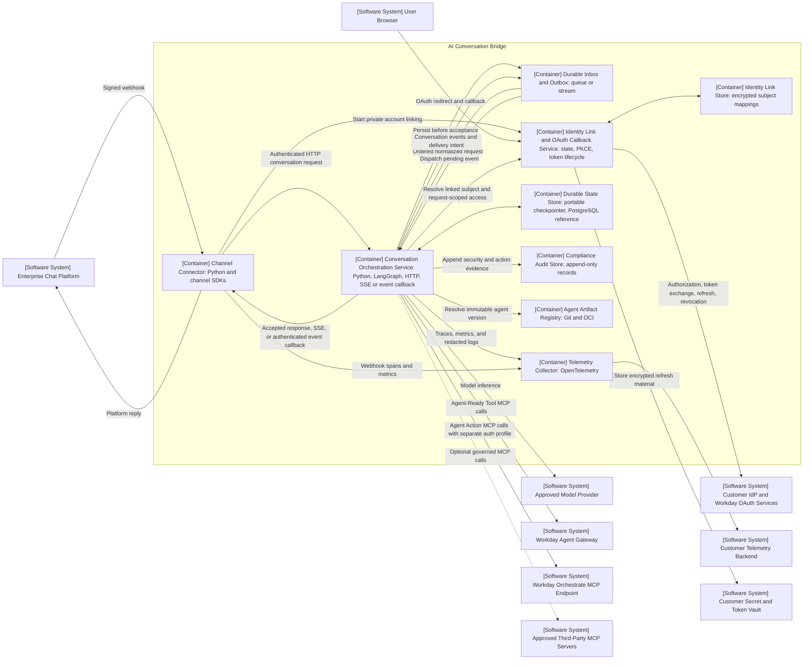
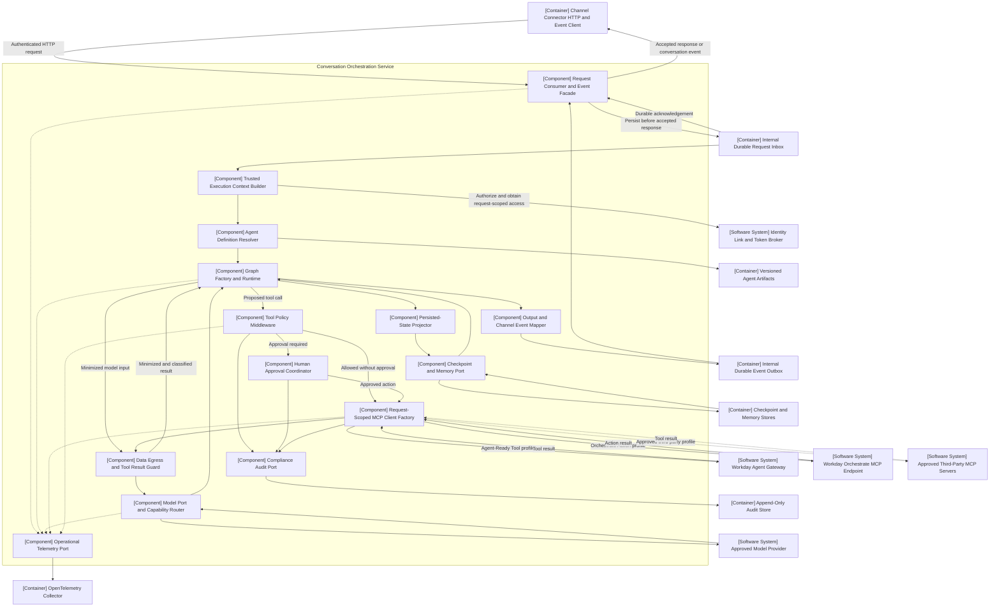
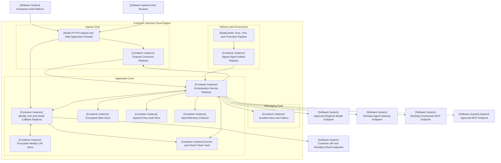
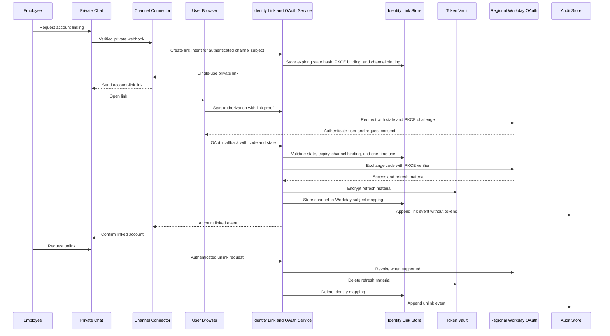
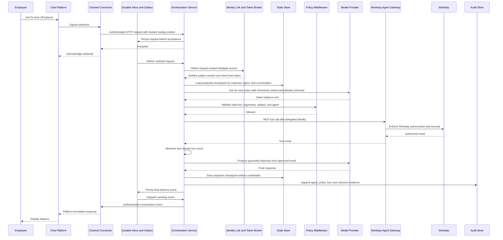
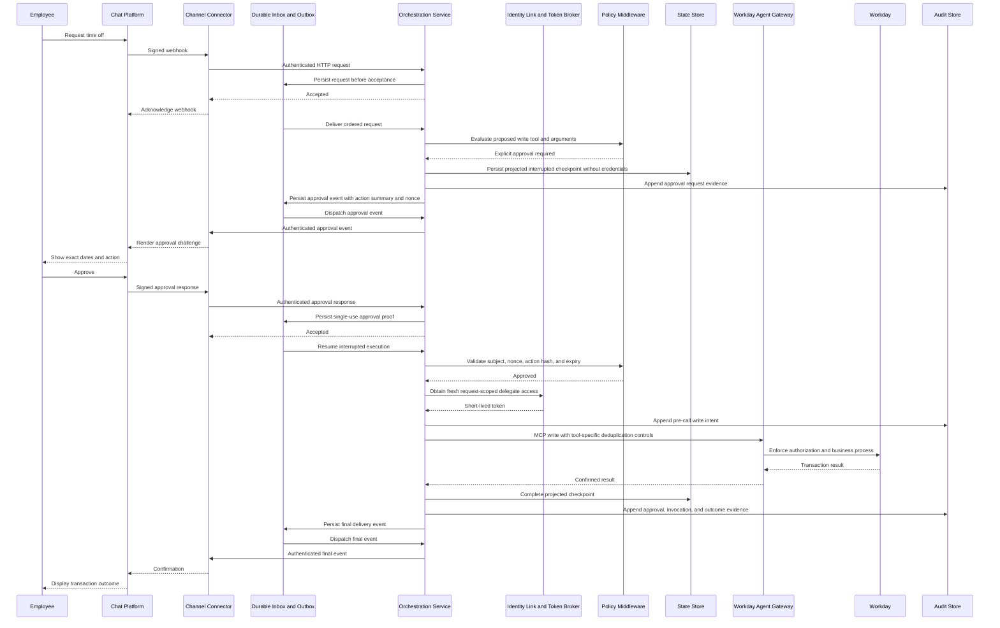

# Proposal: Portable LangGraph Orchestration for the AI Conversation Bridge

| Field | Value |
| --- | --- |
| Status | Proposed |
| Audience | Architecture Review Panel |
| Date | 2026-07-22 |
| Decision type | Target architecture and phased validation |
| Scope | Architecture proposal only; no implementation is authorized by this document |

## Executive Summary

The AI Conversation Bridge currently depends on Flowise as its central orchestration runtime. Based on the lifecycle direction supplied by the business sponsor, that dependency is no longer a durable strategic anchor for a customer-hosted reference architecture. The formal lifecycle notice must be attached to the panel record before a final decommission decision. The existing value proposition remains valid: customers that do not want Sana must still be able to bring their own chat surface, model, infrastructure, and agent logic while using Workday as the governed system of action.

The supplied prototype shows the intended LangGraph integration path, and its author reports successful interactive tests. Code inspection confirms that the prototype is designed to:

- Connect to a remote Workday-compatible MCP endpoint.
- Discover MCP tools dynamically.
- Use an OpenAI-compatible model through OpenRouter.
- Execute a ReAct-style model and tool loop.
- Stream model and tool events.
- Carry conversation history across turns.

The prototype is useful feasibility evidence, not production evidence. It is an unversioned local script without a dependency manifest or captured test results. It uses a single process, in-memory history, startup-time tool discovery, and a shared MCP credential. It does not yet address per-user Workday authorization, durable ingestion, durable execution, tenant isolation, policy enforcement, human approval, checkpoint privacy, compliance audit, observability, deployment, or support.

This proposal recommends:

1. Adopt **LangGraph as the reference orchestration engine**.
2. Keep LangGraph behind a **company-owned Conversation Orchestration API** so clients never depend on LangGraph-specific APIs or state formats.
3. Use open standards at external boundaries: MCP, OAuth/OIDC, OpenTelemetry, OCI containers, and HTTP with streaming events.
4. Make model access, MCP access, state, policy, identity, and observability explicit ports with replaceable adapters.
5. Route **Agent-Ready Tools through Workday Agent Gateway** and **Agent Actions through the supported Workday Orchestrate MCP endpoint**, with agent registration and governance through **ASOR** where available and entitled.
6. Keep the deployment customer-hosted and region-local by default. Workday-hosted agents and Sana remain optional paths, not prerequisites.

The revised business proposition is: **connect customer-approved agent implementations and user experiences to Workday safely, without forcing the customer to adopt a particular chat surface or Workday-hosted reasoning runtime.**

As of this proposal date, the referenced Agent-Ready Tools are available to early-access customers through Workday Extend Professional, with general availability projected for the second half of 2026. Production approval therefore depends on confirmed region, tenant type, entitlement, support status, and a supported identity flow; projected availability is not an implementation guarantee.

## Decision Requested

The panel is asked to approve:

1. LangGraph as the primary reference runtime for the next validation phase.
2. The abstraction boundaries and C4 target architecture in this proposal.
3. A phased migration that retains Flowise as a temporary new-session fallback until security and production gates pass.
4. The revised Workday value proposition centered on Agent Gateway, Agent-Ready Tools, Agent Actions for Workday Orchestrate, and ASOR.
5. Delegated user identity and Agent Gateway feasibility as the first implementation spike and a hard stop before broad parity work.

The panel is not being asked to approve:

- The current prototype for production use.
- A specific cloud, database, model provider, or managed LangGraph service.
- A replacement visual flow builder.
- A direct cutover from Flowise.
- A static shared credential for production Workday access.

## Context

### Current architecture

The current request path is:

The chat connector is thin at its AI boundary: it sends a message and platform-scoped session ID to an AI backend and returns text to the originating chat platform. It is not yet a durable asynchronous connector: it waits synchronously for a string response, DingTalk callbacks have no cryptographic inbound verification in the current implementation, and LINE WORKS signature verification fails open when its bot secret is absent. The target design therefore preserves the channel boundary but requires connector changes for fail-closed verification, fast acknowledgement, durable delivery, deduplication, approvals, and streaming events.

The main behavioral migration burden is the orchestration logic encoded in the Flowise flow: prompt policy, model selection, tool discovery, tool execution, and window memory. The current export does not configure a structured-output schema, leaves agent-level “Require Human Input” unset, and relies primarily on prompt instructions for write confirmation. Its Custom MCP configuration declares an approval policy, but that behavior is not exercised or evidenced by the current connector. The demo MCP server is unauthenticated and resolves every request through one process-wide worker ID.

### Business drivers

- Preserve a non-Sana path for customers that require their own agent or user experience.
- Preserve regional deployment and model choice for APJ data residency and regulatory needs.
- Avoid replacing one hard-coded orchestrator dependency with another.
- Give Workday a durable go-to-market role even when the reasoning runtime is customer-owned.
- Support both Workday and non-Workday tools through standards rather than proprietary connectors.
- Improve testability, change control, and operational transparency.

### Technical drivers

- Per-user Workday authorization must be separate from chat session identity.
- Long-running or approval-gated operations must survive process restarts.
- Models and MCP servers must be replaceable without changing chat adapters.
- Policies for tool access and write approval must be deterministic, not prompt-only.
- Agent definitions, prompts, and tool policies must be versioned and auditable.
- Production deployments need end-to-end tracing without exposing prompts, credentials, or sensitive tool results.

## Business Value Proposition

### Original proposition

1. Unblock customers that do not want Sana and need to bring their own agents and UI or chat surface.
2. Provide a go-to-market channel for Flowise.

### Proposed proposition

1. **Customer choice without Workday compromise.** Customers can run the reference orchestration service in their cloud and region, select an approved model, and retain their chat surface while Workday remains the secure system of action.
2. **An open front door to the Workday agent platform.** Customer and partner agents consume Agent-Ready Tools through Agent Gateway and Agent Actions through the supported Workday Orchestrate MCP endpoint, with governance and lifecycle visibility through ASOR where available.
3. **A reusable partner pattern.** Partners can build one governed Workday integration pattern and reuse it across LINE WORKS, DingTalk, WeChat, Feishu, custom portals, and future channels.
4. **Regional adoption.** Customers can keep orchestration, state, and model inference in an approved region and choose region-appropriate models.
5. **Lower strategic concentration risk.** The architecture depends on stable contracts and open protocols rather than the lifecycle of a single visual builder.

### Value by stakeholder

| Stakeholder | Value |
| --- | --- |
| Customer IT | Choice of cloud, region, model, channel, state store, and operations model |
| Security and risk | Workday authorization at the tool boundary, explicit approvals, tenant isolation, and traceable actions |
| Employees and managers | Workday access in the chat surface they already use |
| Workday | Adoption of Agent Gateway, Agent-Ready Tools, ASOR, Agent Actions for Workday Orchestrate, and eligible Workday Build capabilities |
| Partners | A repeatable reference architecture rather than a one-off channel integration |
| Engineering | Testable code-first orchestration, explicit state, version control, and standard telemetry |

### Business tradeoff

LangGraph is code-first. It provides more control and deployment portability than a visual builder, but the executable graph and checkpoint semantics remain LangGraph-specific. It transfers more engineering and operational responsibility to the team or customer running it. This proposal does not claim that the target state is automatically cheaper than Flowise or runtime-neutral; it claims that the target state is more controllable and testable, while isolating framework coupling behind replaceable internal contracts.

## What the Prototype Proves

| Area | Demonstrated | Not yet demonstrated |
| --- | --- | --- |
| MCP | Remote HTTP connection and dynamic tool discovery | Per-user credentials, tool policy, schema change handling, production Agent Gateway |
| Model | OpenRouter through an OpenAI-compatible client | Multiple approved providers, capability validation, regional policy, safe fallback |
| Orchestration | ReAct model and tool loop using `create_agent` | Deterministic branches, durable execution, resumability, concurrency |
| Streaming | Model token and tool-start events | Stable client event contract, backpressure, reconnect, channel-specific rendering |
| Memory | In-process message history | Persistent checkpoints, retention, deletion, summarization, tenant isolation |
| Security | Secrets loaded from environment | Delegated user identity, ASOR agent identity, secret rotation, write approval |
| Operations | Interactive CLI | Service API, horizontal scaling, telemetry, SLOs, deployment and rollback |

The prototype should be treated as an architecture spike. Its direct dependencies and APIs are implementation candidates, not public contracts. Appendix A records the currently available evidence and the reproducibility gaps.

## Goals and Non-Goals

### Goals

- Preserve thin, channel-specific chat adapters.
- Provide a stable request, response, and streaming contract independent of LangGraph.
- Allow customer-approved model providers, including region-local and OpenAI-compatible models.
- Connect to one or more MCP servers through explicit server and tool policy.
- Use endpoint-appropriate Workday credentials scoped to the current request.
- Support durable, resumable conversations and human approval.
- Keep secrets out of prompts, model requests, checkpoints, and logs.
- Support customer-hosted deployment in a selected region.
- Produce correlated audit and operational telemetry.
- Version agent behavior and validate changes before promotion.
- Use a dedicated single-customer deployment as the initial tenancy model.

### Non-goals

- Recreate the Flowise visual canvas.
- Build a general-purpose integration platform.
- Replace Workday Agent Gateway, ASOR, Workday security, or business process controls.
- Treat chat-platform identity as Workday authorization.
- Make every LLM eligible for tool use.
- Persist all prompts and tool results by default.
- Require LangSmith or another proprietary control plane.
- Support every chat channel, model provider, and state backend in the first release.
- Provide a pooled multi-customer SaaS deployment in the first release.

## Architecture Principles

1. **Own the boundary, not every dependency.** Expose a stable Conversation Orchestration API; keep LangGraph internal.
2. **Standards at every external edge.** Prefer versioned MCP, OAuth/OIDC, OpenTelemetry, OCI, HTTP, and portable data formats.
3. **Identity is not a session ID.** Channel identity, enterprise user identity, agent identity, and service identity are distinct.
4. **Prompts guide behavior; policy grants authority.** Tool allowlists, write controls, and approvals must be enforced outside the prompt.
5. **State is explicit and minimized.** Separate execution checkpoints, conversation memory, compliance audit records, and business data; prove what the checkpointer persists.
6. **Credentials are request-scoped.** Do not place user tokens in graph state or long-lived MCP client configuration.
7. **Agent behavior is a versioned artifact.** Prompts, graph templates, model requirements, tools, policies, and output schemas change together.
8. **Managed services are optional.** A managed platform may be selected later, but the core runtime must remain deployable without it.
9. **Production Workday access uses the documented Workday route.** Agent-Ready Tools use Agent Gateway; Agent Actions use the supported Workday Orchestrate MCP endpoint and its authentication profile. Do not collapse distinct Workday routes into one generic credential.
10. **No silent capability downgrade.** If an approved model, region, identity path, or policy is unavailable, fail safely rather than selecting an unapproved substitute.

## Before and After Comparison

| Dimension | Before: Flowise-centered | After: LangGraph-backed portable architecture |
| --- | --- | --- |
| Public AI contract | Flowise prediction request and response shape | Company-owned conversation and event contract |
| Orchestration engine | Flowise flow runtime | LangGraph behind an internal adapter |
| Agent definition | Flowise JSON export | Versioned agent package with graph template, prompt, model requirements, tools, and policies |
| Model selection | Configured in a Flowise node | Capability-based model port with approved provider profiles |
| Tool integration | Flowise Custom MCP node | MCP registry and request-scoped client factory |
| Workday identity | Demo/static token pattern; production path implicit | Explicit user, agent, and service identity with short-lived delegation |
| Conversation state | Flowise window memory | Custom persisted-state projection plus separately governed conversation memory |
| Write safety | Primarily prompt instructions and Flowise approval behavior | Deterministic tool policy, interrupt, signed approval, and resumable execution |
| Tool access | Tools loaded into the flow | Per-agent and per-user allowlists, endpoint-specific Workday enforcement, and schema validation |
| Observability | Flowise-specific logs and optional tracing | OpenTelemetry traces, metrics, redacted logs, and evaluation results |
| Deployment | Customer-managed Flowise runtime | Customer-managed OCI service and state in an approved region |
| Scaling | Flowise deployment model | Stateless API workers with external durable state |
| Webhook delivery | Synchronous request and string response | Fail-closed verification, durable inbox, deduplication, ordered processing, and outbox delivery |
| Audit | Runtime logs and optional platform tracing | Separate append-only compliance audit plus operational OpenTelemetry |
| Change control | Edit/export/import flow | Pull request, tests, signed version, staged promotion, rollback |
| Lock-in control | Chat connector is portable; orchestration is Flowise-specific | Clients and external systems are isolated from LangGraph-specific APIs |
| Workday GTM value | Flowise adoption | Agent Gateway, Agent-Ready Tools, ASOR, Agent Actions for Workday Orchestrate, and eligible Workday Build adoption |

## Proposed Target Architecture

### C4 Level 1: System Context

The AI Conversation Bridge is the system of interest. It owns conversation orchestration but does not own the chat platform, model provider, Workday authorization, or third-party systems. C4 stereotypes are shown in square brackets; solid arrows are required runtime relationships and dotted arrows are optional.

### C4 Level 2: Container View

The stable connector boundary is HTTP: a connector submits an authenticated normalized request, receives acceptance only after the internal durable inbox commits, and consumes the same event schema by SSE or an authenticated callback. The queue and outbox are internal implementation details, not connector contracts. This lets connectors acknowledge platform webhooks quickly, deduplicate platform retries, serialize each conversation, and deliver replies after an orchestrator restart.

The initial tenancy model is a dedicated single-customer deployment. A logical Workday tenant or environment is selected from trusted deployment and connector configuration, never from an untrusted request field. A pooled multi-customer service requires a separate review of isolation, routing, metering, support, and legal boundaries.

The internal Agent Artifact Registry is authoritative for executable graph artifacts, prompts, policies, and evaluation evidence. ASOR is authoritative for Workday-facing agent registration, activation, skills, and permissions. Promotion records an immutable mapping between the internal agent version and the corresponding ASOR agent identity and configuration.

### C4 Level 3: Orchestration Service Components

All proposed tool calls, including reads, pass through policy before MCP execution. Tool results pass through a data guard before entering model context or persistent state. `create_agent` can remain a supported graph template for simple ReAct agents, but its default message state is not assumed to be privacy-safe: tool results are normally part of message state and may be checkpointed. The target therefore requires a custom persisted-state projection, explicit ephemeral fields, and checkpoint-content tests. More complex agents can use explicit StateGraphs with deterministic branches, subgraphs, interrupts, and specialized state while sharing the same ports.

### Deployment View

The reference deployment uses standard container and service contracts. Kubernetes, Cloud Run, container apps, or an equivalent runtime can host it if the platform supports required streaming, durable messaging, outbound connectivity, secret and OAuth token management, append-only audit, and durable state.

## Runtime Interaction Flows

### Private account linking and revocation

The callback validates OAuth state, PKCE, expiry, and the original private channel subject before creating a link. Link and unlink operations are auditable, and raw tokens never enter conversation state.

### Read request

### Write request with human approval

Channels that cannot securely represent approval must default to read-only behavior or use a separate authenticated approval surface. A plain, context-free “yes” is not sufficient approval for a sensitive action. Sensitive reads and all approvals require a private, identity-bound conversation; a group conversation must redirect the user to an approved private surface.

MCP does not provide universal business-level idempotency. Each production write tool must provide tested provider-side idempotency or an authoritative reconciliation query. Before invocation, the audit store records a write intent. If the process loses the response after dispatch, the outcome becomes `UNKNOWN`; the runtime does not re-invoke automatically and uses reconciliation or manual resolution. A write tool with neither idempotency nor reconciliation remains disabled in production.

## Portability and Flexibility Model

### Stable conversation boundary

Connectors interact with a company-owned HTTP contract, not the internal queue and not LangGraph thread or run APIs. The request is accepted only after the durable inbox commits. Conversation events use one versioned schema delivered over SSE for connected clients or an authenticated callback for webhook-style connectors.

An inbound request conceptually contains:

- A trusted customer and Workday-environment context derived by the connector or deployment.
- Agent identifier and approved version or deployment alias.
- Conversation and message identifiers.
- User text and locale.
- Authenticated subject or an opaque identity reference.
- Minimal channel capabilities and reply context.
- Correlation ID and response mode.

The service does not trust a caller-supplied tenant, agent version, subject, or model profile. Those values are derived from authenticated connector identity and deployment policy.

The outbound stream uses stable event types:

- Request accepted.
- Text delta.
- Tool status.
- Approval required.
- Final response.
- Recoverable error.
- Terminal error.

Channel-specific formatting stays in the connector. LangGraph event names such as `on_chat_model_stream` are translated inside the orchestration service and are never exposed as the durable client contract.

### Versioned agent definition

An agent version groups:

- Agent metadata and owner.
- Graph template and state schema version.
- System prompt and localization assets.
- Required model capabilities.
- Approved model profiles and regional restrictions.
- MCP server aliases, endpoint type, authentication profile, and tool allowlists.
- Read, write, approval, and retry policy.
- Checkpoint and conversation retention policy.
- Structured output schema.
- Evaluation suite and release evidence.
- ASOR agent identity and configuration mapping when Workday tools are enabled.

The artifact is immutable after promotion. A change creates a new version that can be tested, canaried, rolled back, and audited.

### Model port

The model port hides provider SDKs and supports capability-based selection.

Required capabilities are declared by the agent, for example:

- Tool calling.
- Structured output.
- Streaming.
- Required context length.
- Supported language or locale.
- Approved data classification and region.

OpenRouter is one adapter, not the model boundary. OpenAI-compatible providers can often be configuration-only; providers with unique capabilities can use a dedicated adapter. Fallback is allowed only within an approved profile that satisfies the same capability, residency, and data-handling rules.

### MCP port

`MultiServerMCPClient` is an implementation detail behind an MCP client factory.

The MCP port is responsible for:

- Approved server descriptors and transport configuration.
- Supported MCP protocol versions and negotiation.
- Tool namespacing and per-agent allowlists.
- Agent Gateway as the production route for Agent-Ready Tools.
- The supported Workday Orchestrate MCP endpoint as the separate production route for Agent Actions.
- Distinct credential and token-lifecycle profiles for each Workday route.
- Request-scoped credential injection.
- Tool schema validation and controlled caching.
- Timeouts, circuit breaking, and safe retry classification.
- Correlation and audit metadata.
- Tool result size and content limits.
- Server health and schema-change detection.

The current stable MCP specification is `2025-11-25` as of this proposal date. The `2026-07-28` release candidate contains breaking changes and is scheduled to become final shortly after this review. The implementation must declare supported protocol versions, exercise client/server compatibility tests, and gate specification upgrades rather than assuming that “MCP-compatible” means indefinitely compatible.

Tool schemas may be cached; user credentials must not be cached in agent definitions or persisted graph state. A production agent must not receive every tool a server happens to expose.

### State and memory port

Four data categories remain separate:

| Category | Purpose | Typical retention |
| --- | --- | --- |
| Execution checkpoint | Resume a graph after restart, failure, or approval | Short and policy-bound |
| Conversation memory | Preserve useful prior context | Customer-configurable and minimised |
| Compliance audit | Prove who invoked which agent, policy, approval, and tool | Compliance-defined in a separate append-only store |
| Workday business data | Complete the current user request | Not retained unless explicitly required |

Checkpoint keys include trusted customer context, Workday environment, agent version, and conversation to prevent collisions. LangGraph checkpointers normally persist graph state, and a `create_agent` message state normally contains tool results. The target must therefore implement and test a persisted-state projection or equivalent serializer before claiming that unnecessary Workday records are excluded. Credentials and raw authorization headers are prohibited regardless of serializer. The store must support encryption, deletion, retention enforcement, optimistic concurrency, and region-local deployment.

### Identity port

The architecture distinguishes:

1. **Channel identity**: the LINE WORKS, DingTalk, or other platform user ID.
2. **Enterprise user identity**: the verified person represented by that channel account.
3. **Agent identity**: the registered agent and its permitted skills or tools.
4. **Service identity**: the workload calling model, state, identity, and MCP services.

The initial interactive use case is a **delegate skill** that acts for a specific Workday user. Current Workday guidance uses ASOR registration and an OAuth 2.0 Authorization Code Grant with registered redirect handling for delegate skills. The target therefore needs:

- A private account-linking flow from channel identity to the enterprise user.
- ASOR-created agent and OAuth client materials.
- A registered redirect endpoint, OAuth state validation, PKCE, and explicit user authorization.
- An encrypted identity-link store bound to the original private channel subject.
- Encrypted refresh-token storage outside graph state.
- Short-lived access tokens injected only into the current MCP request.
- Refresh, expiry, revocation, logout, and negative-authorization handling.

Ambient agents use a distinct x509 and agent service identity model and are outside the first interactive pilot. The exact supported regional endpoints and credentials must be validated with the responsible Workday teams before implementation. A shared `WORKDAY_MCP_API_KEY` is acceptable only for a mock development server.

### Policy and approval port

Prompts can instruct the model, but they cannot authorize an action.

Deterministic middleware enforces:

- Server and tool allowlists.
- Read versus write classification.
- User and agent permissions.
- Argument validation and risk rules.
- Human approval requirements.
- Approval expiry and replay prevention.
- Maximum tool calls and loop limits.
- A production-write gate requiring tested provider idempotency or authoritative reconciliation.
- Pre-call audit intent and an explicit `UNKNOWN` state for ambiguous write outcomes.
- Output classification and redaction.

LangGraph interrupts and durable checkpoints provide the execution mechanism. The policy decision remains framework-independent and testable.

### Telemetry and evaluation port

OpenTelemetry is the default portability boundary for traces and metrics. LangSmith or another agent-specific platform may be added, but is not required to run the service.

Operational telemetry must:

- Correlate webhook, graph, model, policy, and MCP activity.
- Record agent and prompt versions.
- Measure model latency, tool latency, failures, token use, and approval outcomes.
- Redact credentials, prompts, and tool payloads according to policy.

Compliance audit is a separate, access-controlled, append-only record. It captures authenticated subject, agent version, policy decision, approval evidence, tool identity, outcome, and correlation identifiers without using OpenTelemetry as the system of record. Its integrity, retention, export, and privileged access controls are defined with security and compliance owners.

Every promoted agent version should pass deterministic scenarios and model-based evaluations for tool selection, grounded answers, refusal, authorization failure, approval, and multilingual behavior.

## Workday Portfolio Alignment

The proposed runtime does not attempt to replace Workday platform controls.

| Workday capability | Role in the target architecture |
| --- | --- |
| Agent Gateway | Secure MCP entry point and control point for Agent-Ready Tools |
| Agent-Ready Tools | Agent-oriented access to Workday data and actions through Agent Gateway |
| ASOR | Registration, lifecycle, visibility, and governance for eligible external agents |
| Agent Actions for Workday Orchestrate | Deterministic workflows exposed through the supported Orchestrate MCP endpoint and its own authentication profile |
| Developer Agent | Optional development accelerator, not a required runtime |
| Agent Passport | Future or eligible assurance evidence for agent validation |
| Pipedream | Optional third-party connector layer where residency, security, and entitlement permit |
| Sana | Optional full-stack user experience and orchestration path |

ASOR is publicly described as generally available, but each external-agent integration and regional path still requires validation. Agent-Ready Tools are publicly described as early access through Workday Extend Professional as of this proposal date, with general availability projected for the second half of 2026. Availability, regional coverage, onboarding, supported tenant types, support status, and commercial entitlement must be confirmed before a production commitment. The architecture must not depend on a projected feature without an approved fallback and explicit risk acceptance.

## Quality Attributes

| Attribute | Architecture response |
| --- | --- |
| Portability | Company-owned API, standard protocols, OCI deployment, replaceable adapters, no mandatory managed control plane |
| Security | Endpoint-specific request credentials, Workday enforcement, tool allowlists, policy middleware, approval and audit |
| Reliability | Durable checkpoints, bounded retries, tool-specific deduplication or reconciliation, timeouts, circuit breakers, and safe resume |
| Scalability | Stateless API workers with external state and independent channel connectors |
| Performance | Streaming, bounded history, tool schema cache, connection reuse, and explicit latency budgets |
| Data residency | Customer-selected region for orchestration and state; approved regional model endpoints |
| Operability | OpenTelemetry, health checks, deployment versioning, canaries, rollback, and runbooks |
| Maintainability | Versioned agent packages, contract tests, dependency pinning, and isolated framework adapters |
| Testability | Deterministic graph tests, MCP contract tests, policy tests, replay fixtures, and model evaluations |

## Security, Privacy, and Abuse Controls

| Threat | Required control |
| --- | --- |
| Forged chat webhook | Platform signature validation, timestamp checks, replay protection, and ingress rate limits |
| Confused deputy | Verified user linking, agent identity, delegated token, and endpoint-specific Workday authorization |
| Prompt injection | Tool allowlists, policy outside the prompt, untrusted-content boundaries, and output controls |
| Tool poisoning or schema drift | Trusted MCP registry, schema validation, version monitoring, and canary tests |
| Duplicate or ambiguous write | Require provider idempotency or authoritative reconciliation, record pre-call intent, mark missing responses `UNKNOWN`, and never retry an unknown write automatically |
| Cross-context state leak | Trusted context-scoped keys, authorization on every state operation, and isolation tests |
| Credential leakage | Secret manager, request-scoped injection, log redaction, and no credentials in checkpoints |
| Excessive retention | Data minimization, customer retention policy, deletion API, and region-local storage |
| Runaway agent loop | Step, tool-call, token, time, and cost budgets |
| Dependency compromise | Locked dependencies, SBOM, artifact signing, vulnerability scanning, and controlled upgrades |
| Sensitive model egress | Approved provider and region policy, field minimization, redaction, and no token forwarding to the model |

## Reliability and Failure Semantics

- Every request has an end-to-end deadline and per-dependency timeout.
- Retries are limited to transient failures and safe operations.
- Production writes require tested provider idempotency or authoritative reconciliation; the model never decides whether a retry is safe.
- A pre-call write intent is durable before dispatch. A missing response produces an `UNKNOWN` outcome that must be reconciled or manually resolved.
- An orchestrator restart resumes from a durable checkpoint.
- A missing or expired user credential pauses or fails safely; it does not fall back to a shared identity.
- An unavailable approved model fails or uses only a pre-approved equivalent profile.
- An unavailable Workday tool returns a grounded failure; the model must not simulate a successful transaction.
- Approval timeouts close the pending action and require a new request.
- Tool schemas are validated before promotion and monitored for incompatible change.
- Flowise remains a temporary new-session fallback until the replacement meets production gates. LangGraph checkpoints and pending approvals cannot move to Flowise.

## Delivery and Migration Plan

### Gate governance

Before the pilot begins, the architecture owner, product owner, security owner, and operations owner approve one Quality Gate Matrix. Every row identifies the metric, Phase 0 baseline, numerical target, evidence source, owner, and decision authority.

Mandatory gates that do not depend on a performance baseline are:

- 100% of required negative-authorization scenarios deny access.
- Zero credentials appear in prompts, checkpoints, telemetry, or audit payload fields.
- Zero unapproved tools execute in policy tests.
- Zero duplicate writes occur in crash and replay tests for enabled write tools.
- Every ambiguous write is marked `UNKNOWN` and reconciled or manually closed without automatic re-invocation.
- 100% of critical security and transaction scenarios pass before promotion.

Latency, availability, error-rate, quality, cost-per-conversation, and support-load targets require measured baselines and named owners; they must be approved before Phase 4 starts.

The Phase 5 portability matrix requires pass/fail evidence for:

| Boundary | Minimum proof |
| --- | --- |
| Model | Two approved model profiles pass the same critical evaluation suite |
| Workday MCP | Agent Gateway and the Workday Orchestrate MCP endpoint pass their separate authentication and contract suites |
| Channel | Two connectors use the same HTTP request and event contract without graph changes |
| Deployment | Two approved deployment targets or regions pass the same operational tests |
| Runtime upgrade | Active work is drained or migrated across one controlled LangGraph upgrade without a client-contract change |

### Phase 0: Architecture and contracts

- Approve this target architecture and ownership model.
- Define the stable conversation and streaming event contract.
- Define the versioned agent package.
- Complete a threat model and data-flow review.
- Attach the formal Flowise lifecycle decision to the review record.
- Attach current Workday delegate-authentication and Workday Orchestrate MCP guides to the review record.
- Put the prototype under version control with a locked dependency manifest and reproducible test record.
- Baseline current Flowise behavior, latency, tool success, failure modes, and support effort.
- Assign owners and approval dates for every Quality Gate Matrix target.
- Confirm named owners for Agent Gateway, ASOR, channel security, state, audit, and operations.

Exit gate: architecture panel approval, reviewable evidence, baseline measures, and named owners.

### Phase 1: Delegated identity and Agent Gateway feasibility

- Register a non-production delegate agent in ASOR.
- Validate the Workday OAuth authorization-code flow, redirect handling, consent, refresh, expiry, revocation, and logout.
- Link one private channel user to a Workday user without treating the channel ID as authorization.
- Invoke one read-only Agent-Ready Tool through the supported regional Agent Gateway.
- Test denied access, revoked access, wrong user, wrong agent, wrong Workday environment, and unsupported region.
- Confirm entitlement, support status, and production roadmap for the target customer profile.

Exit gate: request-scoped delegation and negative-authorization tests pass in a supported region. If they do not, broad parity implementation stops.

### Phase 2: Behavioral parity and service boundary

- Convert the prototype into a service behind the stable API.
- Add fail-closed webhook verification, durable inbox, deduplication, per-conversation ordering, and outbound delivery.
- Recreate the existing Workday MCP assistant behavior in a versioned agent package.
- Use the demo MCP server and approved non-production model.
- Add a custom persisted-state projection, tool allowlists, structured output, and contract tests.
- Establish a regression evaluation set from the existing Flowise behavior.
- Treat stronger identity, policy, and state controls as intentional security improvements rather than reproducing insecure demo behavior.

Exit gate: parity scenarios and checkpoint-content tests pass without requiring Flowise-specific client behavior.

### Phase 3: Production controls

- Add deterministic policy for every read and write tool.
- Add private-channel enforcement, secure approval, the production-write capability gate, pre-call intent, `UNKNOWN` outcome handling, and durable resume.
- Add the append-only audit store separately from operational telemetry.
- Add model egress minimization, tool-result filtering, prompt-injection controls, and loop budgets.
- Add health checks, deadlines, circuit breakers, runbooks, supported-version policy, and rollback controls.
- Complete security, privacy, and data residency reviews.

Exit gate: security, privacy, operational readiness, and approval tests pass; no shared production user credential exists.

### Phase 4: Controlled channel pilot

- Enable one existing chat channel for a limited user cohort and read-focused use cases.
- Operate with SLOs, telemetry, runbooks, rollback, and support ownership.
- Compare latency, quality, tool success, cost, and support load with the approved Quality Gate Matrix.
- Introduce a limited write use case only after approval controls are validated.

Exit gate: pilot acceptance criteria and operational readiness review pass.

### Phase 5: Portability proof

- Validate a second approved model profile.
- Validate Agent Gateway and the separate Workday Orchestrate MCP endpoint.
- Validate a second chat channel without changing graph logic.
- Validate a second deployment target or region.
- Demonstrate checkpoint drain or export for a controlled runtime upgrade.

Exit gate: the approved portability matrix passes for model, MCP, channel, deployment, and runtime upgrade boundaries.

### Phase 6: Transition

- Make LangGraph the default reference runtime.
- Publish migration and rollback guidance.
- Freeze new Flowise-specific features.
- Route fallback traffic only for new sessions.
- Drain or fail closed all in-flight LangGraph writes and approvals before rollback.
- Retire Flowise assets only after supported deployments have migrated or accepted an end-of-support plan.

Exit gate: no active LangGraph checkpoint or approval depends on Flowise fallback, rollback is rehearsed, support owners approve cutover, and the end-of-support communication is complete.

## Alternatives Considered

| Alternative | Why it is not the primary recommendation |
| --- | --- |
| Continue with Flowise OSS | Preserves short-term compatibility but not the desired long-term support and strategic portability |
| Sana Agent Builder | Strong Workday-native experience but does not preserve the required non-Sana, customer-hosted path |
| Langflow or Dify | Retains visual authoring but risks moving the central dependency to another product runtime |
| Pipedream capabilities | Valuable for third-party connectivity, but the exact product, execution boundary, regional availability, and entitlement require separate validation |
| Workday-hosted custom agent runtime | Useful secondary path, but does not preserve customer ownership of runtime and model as the default |
| Direct custom model and MCP loop | Minimizes framework dependency but requires rebuilding durable execution, interrupts, state, middleware, and graph semantics |
| Put orchestration in the chat connector | Couples every channel to business logic and prevents independent scaling, testing, and evolution |

## Risks and Mitigations

| Risk | Impact | Mitigation |
| --- | --- | --- |
| LangGraph or LangChain API churn | Upgrade cost and behavioral regression | Keep framework internal, pin versions, use contract tests, and schedule controlled upgrades |
| Loss of visual authoring | Higher developer skill requirement | Provide graph templates, versioned manifests, examples, validation tools, and optional future authoring UI |
| Identity integration is more complex than the prototype | Production delay | Treat identity as the first spike and a hard go-live gate |
| Customer-hosted runtime increases operational burden | Support and reliability risk | Publish a golden deployment, SLOs, runbooks, health checks, and supported-version policy |
| Model changes alter tool behavior | Incorrect actions or degraded quality | Capability profiles, fixed evaluation sets, canary promotion, and no silent model fallback |
| MCP tool schemas change | Runtime failures or unsafe arguments | Schema snapshots, compatibility checks, allowlists, and pre-production validation |
| MCP protocol changes | Client or server incompatibility | Pin supported protocol versions, negotiate explicitly, test both sides, and gate upgrades |
| Default LangGraph state contains sensitive tool results | Privacy and compliance exposure | Custom persisted-state projection, content tests, encryption, retention, and subject deletion |
| Durable messaging adds operational complexity | Delivery or ordering defects | Use a supported queue, idempotent consumers, partition by conversation, and test replay |
| Internal registry and ASOR drift | Wrong agent or tool activation | Immutable ID mapping, reconciliation checks, and promotion gate |
| Prompt injection reaches powerful tools | Unauthorized or harmful actions | Workday authorization, deterministic policy, tool limits, and approval for sensitive writes |
| Cost and latency exceed Flowise baseline | Poor adoption | Instrument tokens and latency, set budgets, summarize memory, and benchmark before cutover |
| Prototype success creates false confidence | Premature production decision | Enforce phased gates and independent security and operational reviews |

## Operating Model and Cost

### Ownership

| Role | Responsibility |
| --- | --- |
| Bridge platform owner | Conversation contract, LangGraph runtime, reference agents, release policy, and support |
| Channel integration owner | Webhook security, channel identity, formatting, and platform API changes |
| Customer platform team | Deployment, regional infrastructure, secrets, state, telemetry, and approved models |
| Workday platform teams | Agent Gateway, ASOR, Agent-Ready Tools, Workday Orchestrate MCP, and supported identity mechanisms |
| Security and privacy | Threat model, model and region approval, retention, control baseline, and review |
| Agent product owner | Use-case behavior, prompt and policy intent, evaluation scenarios, and business acceptance |

### Cost categories

- Engineering and testing for the runtime, adapters, policies, and migration.
- Customer or program operations for compute, state, telemetry, upgrades, and incident response.
- Model inference and optional model gateway costs.
- Workday product entitlements and usage where applicable.
- Security, privacy, evaluation, and ongoing assurance.

No net savings claim should be made until the pilot measures these costs against the current Flowise path. The expected benefit is strategic control and reuse, not guaranteed infrastructure reduction.

## Success Measures and Acceptance Gates

### Architectural portability

- A new chat channel can be added without changing graph behavior.
- A compatible model can be added through configuration; a non-compatible provider requires only a model adapter.
- A new MCP server can be added through an approved descriptor and tool policy.
- No client depends on LangGraph event names, thread APIs, or checkpoint schema.
- LangSmith can be removed without preventing runtime operation.
- A supported LangGraph upgrade can drain or migrate active state without changing client contracts.

### Security and governance

- No production flow uses a shared end-user Workday credential.
- Chat identity cannot independently authorize a Workday action.
- Every tool call is attributable to trusted customer context, Workday environment, user, agent version, tool, and correlation ID.
- Sensitive writes require deterministic policy and auditable approval.
- Credentials do not appear in model input, state, or logs.
- Cross-context state and tool-access isolation tests pass.

### Reliability and operations

- An interrupted conversation resumes after an orchestrator restart.
- Duplicate webhook delivery is removed before tool execution.
- A write is never automatically retried unless that tool declares a tested idempotency or reconciliation capability.
- A missing write response becomes `UNKNOWN` and is reconciled or manually resolved.
- Model, MCP, state, and approval failures have explicit user-visible outcomes.
- End-to-end traces connect webhook, graph, model, policy, and tool spans.
- A previous agent version can be restored without a client change.

### Business outcomes

- Customers can retain their selected chat surface and approved model.
- The same agent behavior is reusable across at least two channels.
- The same runtime can consume both Workday and an approved non-Workday tool source.
- Workday actions remain governed through Workday platform controls.
- Partner onboarding and use-case delivery can be measured against the current baseline.

Numerical SLO and adoption targets are recorded in the owned Quality Gate Matrix before Phase 4. This proposal defines the required measures and zero-tolerance security gates but does not invent workload-specific performance values without a baseline.

## Frequently Asked Questions

### 1. Why LangGraph?

LangGraph provides a code-first, open-source execution model for stateful agents, checkpointed workflows, streaming, interrupts, and human approval. It fits the Python and MCP prototype and gives the team explicit control over graph state and policy. Durable behavior still depends on a correctly configured checkpointer and privacy-safe state design. The recommendation is not to expose LangGraph as the product contract; it is to use LangGraph behind contracts the company owns.

### 2. Are we replacing Flowise lock-in with LangGraph lock-in?

There is still implementation coupling. The mitigation is architectural: clients use a company-owned conversation contract; model, MCP, state, policy, and telemetry are ports; agent behavior is a versioned artifact; and LangGraph-specific state stays inside the runtime. Replacing LangGraph would require a new internal engine adapter, conformance testing, and a checkpoint drain or migration plan, but it would not require changing chat platforms, Workday MCP servers, model contracts, or external clients.

### 3. Why not continue using the public Flowise repository?

That could extend the current architecture temporarily, but it does not address the strategic support concern or improve code-level control, testing, and portability. The sponsor's formal lifecycle evidence must be part of the decision record. Flowise should remain a migration and new-session fallback option, not the long-term architecture anchor.

### 4. Why not use Sana?

Sana remains a valid full-stack Workday option. It does not meet the primary requirement for customers that explicitly want their own agent, model, hosting boundary, or chat surface. The proposal complements Sana rather than replacing it.

### 5. Why not use Workday Developer Agent as the runtime?

Developer Agent can accelerate development and may support Workday-hosted custom agents. It is not the same as a customer-hosted orchestration service, and it does not by itself preserve the requested customer-controlled execution and model boundary. It can be an optional development path.

### 6. Why not expose the native LangGraph server API directly?

Doing so would make thread, run, streaming, auth, and checkpoint semantics part of the external contract. A small company-owned facade prevents client churn during framework upgrades and lets channel clients use a domain-specific contract.

### 7. Is `create_agent` sufficient?

It is sufficient for the current ReAct prototype and may remain the simplest graph template. Its default message state can include tool results that a checkpointer will persist. The target architecture also needs a privacy-safe persisted-state projection, deterministic branches, policy middleware, approval interrupts, loop budgets, and specialized workflows. `create_agent` is one implementation template, not the architecture.

### 8. Why not call the model and MCP server directly from each chat connector?

That would duplicate orchestration, identity, memory, policy, telemetry, and error handling in every channel. It would also make each channel release dependent on agent behavior. The connector should remain a secure protocol adapter.

### 9. How is a LINE WORKS or DingTalk user mapped to a Workday worker?

The chat user ID is only a channel identity. For the initial delegate-skill use case, current Workday guidance requires ASOR registration and OAuth 2.0 Authorization Code Grant handling. A private account-linking flow establishes the user relationship; refresh material is encrypted outside graph state; and a short-lived access token is injected only into the current MCP call. Redirect, refresh, revocation, regional endpoint, and negative-authorization behavior must pass Phase 1.

### 10. Can a shared service account be used to simplify the first production release?

Not for end-user Workday actions. A shared account creates a confused-deputy risk, weakens row-level authorization, and obscures accountability. A system identity may be appropriate for an explicitly designed background process, but that is a separate agent type with separate permissions and audit rules.

### 11. Does Workday data leave Workday?

The minimum tool result required to answer the request enters the customer-hosted orchestrator and may be sent to the customer-approved model provider. Workday authorization controls who can retrieve it, but it does not eliminate downstream data processing. Provider, region, retention, and redaction policies must therefore be approved for the data class involved.

### 12. Are Workday access tokens sent to the model?

No. Tokens are used only by the request-scoped MCP client and are excluded from prompts, tool arguments generated by the model, checkpoints, and logs.

### 13. What prevents the model from calling an unauthorized tool?

The model sees only the allowlisted tools for the selected agent and user context. Deterministic middleware validates the endpoint profile, server, tool, arguments, risk level, and approval state before execution. Agent Gateway or the Workday Orchestrate endpoint then applies the controls supported by that route, and downstream Workday security and business processes remain authoritative.

### 14. What prevents a hallucinated write?

The model cannot directly execute a write. A proposed write passes through argument validation, authorization, risk policy, and human approval when required. The final call uses fresh endpoint-appropriate credentials. Production enablement also requires tested provider idempotency or an authoritative reconciliation query. A write intent is recorded before dispatch; a missing response becomes `UNKNOWN` and is never automatically re-invoked. A tool with neither capability remains disabled.

### 15. How does approval work in chat?

The user receives an exact action summary. Approval is tied to trusted customer context, Workday environment, user, conversation, tool, arguments, expiry, and single-use nonce. The graph pauses durably and resumes only with valid approval proof. Channels without a secure private approval interaction remain read-only or redirect to an authenticated approval surface.

### 16. Can customers use local or China-hosted models?

Yes, if the provider has an approved adapter, supports the agent's required capabilities, and satisfies security, legal, data residency, and network requirements. “OpenAI-compatible” reduces integration effort but does not itself prove tool quality or compliance.

### 17. What if a model does not support reliable tool calling?

It is not eligible for an agent that requires tools. Agent deployment validation checks required capabilities before traffic is routed to a model. The system must not degrade to guessed answers for Workday data.

### 18. What happens if the model provider is unavailable?

The runtime uses a bounded timeout. It may fail over only to an explicitly approved model profile with equivalent capability and residency. Otherwise it returns a clear service failure and preserves resumable state where appropriate.

### 19. What happens if a Workday MCP endpoint or tool is unavailable?

The agent reports that the operation could not be completed. It does not invent data or claim that a transaction succeeded. Safe reads may be retried within policy. A dispatched write with no response becomes `UNKNOWN` and follows its required idempotency or reconciliation design.

### 20. How is conversation memory handled?

Execution checkpoints and conversational memory are separate. History is bounded, summarized where appropriate, encrypted, context-scoped, region-local, and subject to retention and deletion policy. The target intends not to retain raw Workday records merely because they appeared in a tool result, but that claim is accepted only after the custom state projector and checkpoint-content tests prove it.

### 21. Is LangSmith required?

No. OpenTelemetry is the required portability boundary. LangSmith or another specialized product may be adopted for debugging and evaluation after separate security, residency, cost, and procurement review.

### 22. Can non-developers still build agents?

Not with the same visual Flowise experience in the initial target state. This is an explicit tradeoff. The team can provide curated graph templates, declarative agent manifests, validation tooling, and development assistants. A visual authoring layer can be evaluated later without becoming the runtime contract.

### 23. How are existing Flowise flows migrated?

There is no assumption of reliable automated conversion. The current flow's prompt, tools, and memory behavior are reconstructed as a LangGraph agent definition and verified against regression scenarios. Structured output and deterministic approval are intentional security improvements, not existing Flowise behaviors to copy. Flowise remains available for comparison and new-session fallback. It cannot resume LangGraph checkpoints or pending approvals, so in-flight writes must drain or fail closed before traffic switches.

### 24. Who operates and supports the new runtime?

That must be assigned before implementation proceeds beyond a prototype. The bridge platform owner supports the runtime and contracts; the customer platform team operates infrastructure; Workday teams support their platform services; and the agent product owner accepts behavior. This repository remains a reference architecture unless a formal product and support model is approved.

### 25. Is LangGraph's license sufficient for enterprise use?

The LangGraph core is published under the MIT license as of this proposal date. That does not remove the need for legal review, dependency license review, an SBOM, vulnerability management, and separate review of any hosted or enterprise services.

### 26. How will framework upgrades be managed?

Dependencies are pinned. Upgrades occur on a supported cadence through automated tests, replay scenarios, security scans, state compatibility tests, and canary deployment. LangGraph events and checkpoint details are translated behind internal ports so upgrades do not automatically change client contracts. Active state is drained or migrated before an incompatible checkpoint change.

### 27. Why is Pipedream not the central orchestrator?

Pipedream is well suited to managed third-party connectivity and OAuth. It is not selected as the orchestration boundary because the evaluated product, execution location, regional availability, security model, and entitlement have not been established for this proposal. It can remain an optional tool source after those facts are validated.

### 28. Will this be cheaper than Flowise?

Not necessarily. A code-first runtime adds engineering, testing, state, telemetry, and operational costs. It may avoid some product-specific costs and reduce strategic concentration, but a cost claim should be based on pilot measurements.

### 29. How much work is required?

The agent loop itself is small; the production work is not. Identity, endpoint-specific authorization, policy, durable messaging and state, approvals, telemetry, deployment, evaluation, and support dominate the effort. A responsible estimate should follow the delegated-identity and Agent Gateway feasibility spike.

### 30. What happens if Agent Gateway, ASOR, or the required Orchestrate endpoint is unavailable in a region?

The deployment does not silently bypass Workday controls. The use case remains a demo, is restricted to an approved non-production path, or waits for a supported regional capability. Any exception requires explicit architecture and security approval.

### 31. Is the first deployment multi-tenant?

No. The reference starts as a dedicated single-customer deployment. Customer and Workday-environment context comes from trusted connector and deployment configuration, not a user-supplied tenant field. A pooled service requires a separate architecture and threat review.

### 32. Can group chat be used for HR data or approvals?

Not by default. A group conversation can leak an authorized user's personal result to other participants and can make approval attribution ambiguous. Sensitive reads and writes redirect to a private, identity-bound surface unless a use case has an explicitly reviewed audience model.

### 33. Is OpenTelemetry the compliance audit system?

No. OpenTelemetry is for operational traces and metrics. Compliance evidence is written to a separate append-only store with independent access, integrity, retention, and export controls.

### 34. How will MCP specification changes be handled?

The client declares supported protocol versions and runs compatibility tests against every approved server. The current stable baseline is `2025-11-25`; the scheduled `2026-07-28` specification contains breaking changes. Adoption requires an explicit upgrade decision, adapter validation, and regression testing.

### 35. Is the durable queue the connector API?

No. The stable connector boundary is authenticated HTTP. The orchestration service accepts a request only after its internal inbox commits, then delivers the versioned event schema by SSE or authenticated callback. Queue technology and schemas remain private implementation details.

### 36. Are Agent-Ready Tools and Agent Actions for Workday Orchestrate the same MCP route?

No. The architecture treats Agent Gateway and the Workday Orchestrate MCP endpoint as separate logical routes with separate endpoint descriptors, authentication profiles, contract tests, and support owners. They may share Workday infrastructure internally, but the customer runtime must not assume interchangeable URLs or credentials.

## Open Decisions and Dependencies

The following decisions must be resolved before production implementation:

- Supported Workday identity and delegation flow for external chat users.
- Identity-link store, PKCE state, token-vault, unlink, and revocation design.
- ASOR registration and agent identity requirements.
- Agent Gateway and Agent-Ready Tool availability by region and tenant type.
- Workday Orchestrate MCP endpoint, launch authentication, regional routing, and tool contract.
- Formal Flowise lifecycle notice and supported migration window.
- Initial customer cloud and deployment runtime.
- Supported durable inbox, outbox, ordering, and replay technology.
- Durable checkpoint reference backend and retention defaults.
- Persisted-state schema and proof that sensitive tool results are excluded as intended.
- Compliance audit store, integrity control, retention, and access model.
- Approved model providers, regions, and data classifications.
- Secure approval interaction for each chat platform.
- Agent package format, signing, and promotion process.
- Internal agent version to ASOR identity reconciliation process.
- MCP `2025-11-25` support and `2026-07-28` upgrade plan.
- Numerical Quality Gate Matrix targets, owners, and approval authority.
- Operational owner, support boundaries, supported versions, and SLOs.
- Commercial entitlements and usage metering for Workday capabilities.
- Security and legal approval for optional third-party MCP servers.

## Appendix A: Evidence Baseline

### LangGraph prototype

| Item | Evidence available on 2026-07-22 |
| --- | --- |
| Source | Local `langgraph-workday-test/app.py`; not currently in version control |
| Reproducibility | No `pyproject.toml`, requirements file, lockfile, or captured test report |
| Runtime observed | Python 3.14 virtual environment |
| Key installed packages | LangGraph 1.2.9, LangChain 1.3.14, LangChain MCP Adapters 0.3.0, LangChain OpenAI 1.4.0 |
| MCP path | `MultiServerMCPClient` using remote HTTP and optional bearer header |
| Model path | `ChatOpenAI` pointed at OpenRouter |
| Agent path | LangChain `create_agent`, backed by LangGraph |
| State | One in-process message list shared across CLI turns |
| Streaming | Raw LangChain and LangGraph event names consumed by the CLI |
| Test evidence | User-reported successful interactive test; no automated result or execution log attached |

Evidence is added at the phase that introduces the capability:

| Phase | Required evidence |
| --- | --- |
| Phase 0 | Reproducible startup, tool discovery, demo read, model failure, and MCP failure |
| Phase 1 | Successful private linking, authorized read, denied read, revoked token, wrong subject, and wrong Workday environment |
| Phase 2 | Multi-turn isolation, duplicate webhook, restart and resume, outbox replay, and checkpoint-content inspection |
| Phase 3 | Write-disabled default, approval replay denial, provider idempotency or reconciliation, crash-after-dispatch `UNKNOWN`, and manual-resolution path |

### Current repository baseline

- `chat-connector/app/services/flowise.py` exposes a narrow text-plus-session AI boundary.
- `chat-connector/app/routes.py` processes the AI response synchronously.
- LINE WORKS verification currently fails open when its bot secret is absent.
- DingTalk currently validates allowed users and outbound webhook hosts but does not cryptographically verify inbound callbacks.
- `flowise/flows/workday-mcp-agent.json` has no configured structured-output schema and leaves agent-level human input unset.
- `mcp-demo-server/main.py` is unauthenticated and resolves every call through one process-wide `CURRENT_USER_WORKER_ID`.

## Recommendation

Approve LangGraph as the **internal reference engine**, not the external architecture boundary.

Proceed only through the phased gates in this proposal. The first implementation spike should resolve delegated Workday identity and Agent Gateway behavior before investing in broad feature parity. If request-scoped identity, Workday authorization, region-local deployment, durable approval, or auditable tool execution cannot be demonstrated, the architecture should not advance to production.

## References

- [Current repository architecture](architecture.md)
- [Current enterprise hardening guidance](enterprise-guide.md)
- [LangGraph overview](https://docs.langchain.com/oss/python/langgraph/overview)
- [LangGraph source repository](https://github.com/langchain-ai/langgraph)
- [Model Context Protocol specification 2025-11-25](https://modelcontextprotocol.io/specification/2025-11-25)
- [MCP 2026-07-28 release candidate](https://blog.modelcontextprotocol.io/posts/2026-07-28-release-candidate/)
- [Workday 2026 Agent-Ready Tools announcement](https://newsroom.workday.com/2026-06-02-Workday-Launches-New-Tools-for-Developers-to-Build,-Connect,-and-Verify-AI-Agents-For-HR,-Finance,-and-IT)
- [Workday Agent System of Record](https://www.workday.com/en-us/artificial-intelligence/agent-system-of-record.html)
- [Workday ASOR general availability announcement](https://blog.workday.com/en-us/managing-ai-powered-future-of-work.html)
- Current Workday Agent Gateway credentials and authentication guide, to be attached to the internal review record
- Current Agent Actions for Workday Orchestrate MCP guide, to be attached to the internal review record
- [OpenTelemetry](https://opentelemetry.io/)
- [C4 model](https://c4model.com/)
